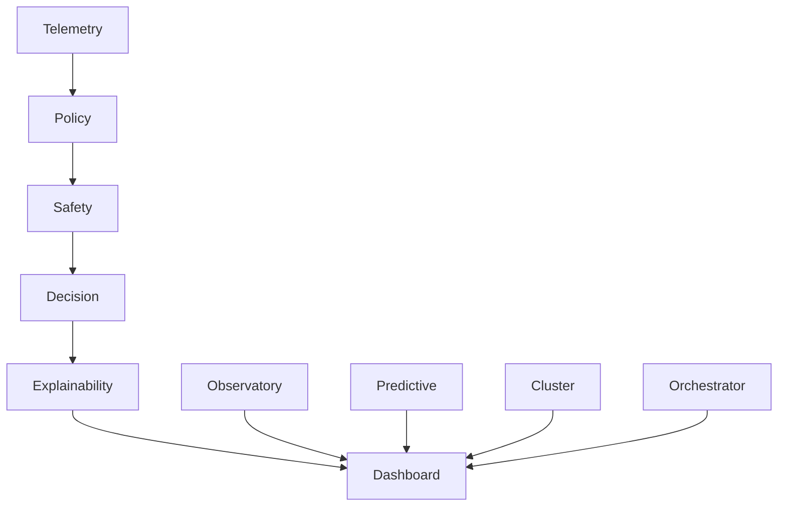
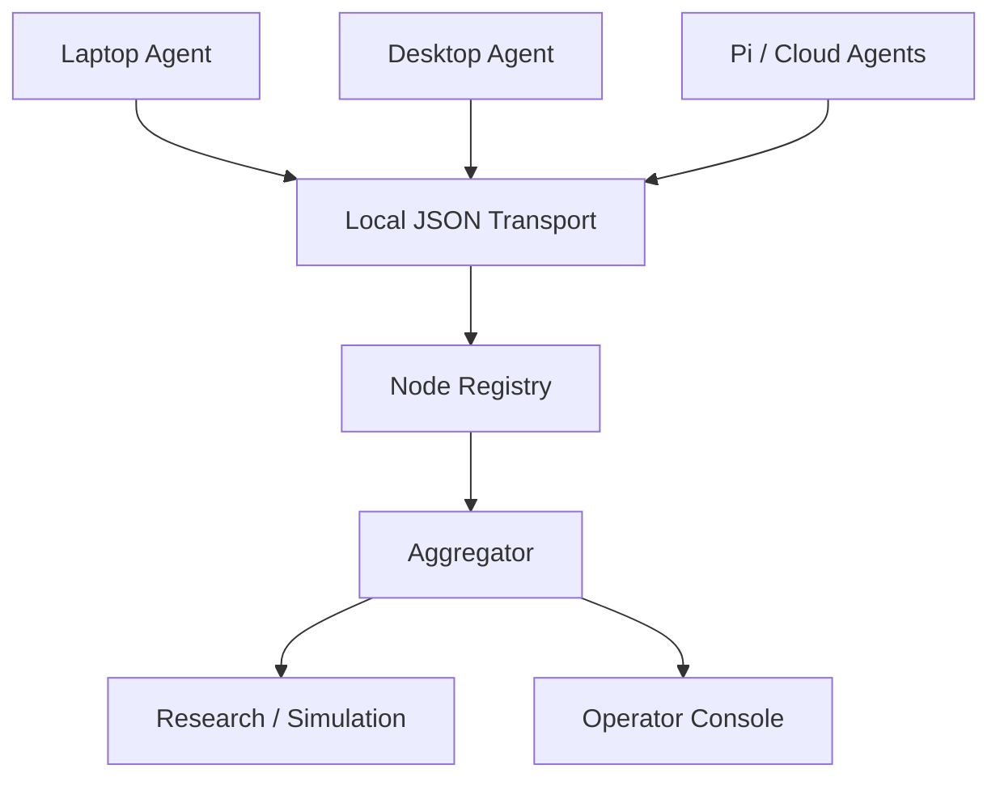
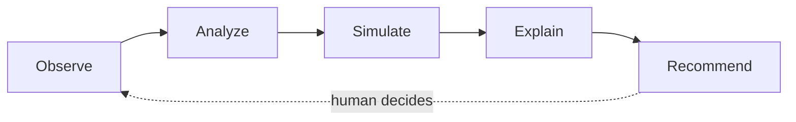

# AetherOS

**Explainable Operating Intelligence Platform**

AetherOS is a research-grade operating intelligence platform that observes, explains, predicts, and simulates system behavior through safe, explainable AI. It never modifies the operating system automatically and remains entirely userspace.

[](https://www.python.org/downloads/)
[](LICENSE)
[](pytest.ini)
[](https://github.com/Textualize/rich)
[](#installation)
[](#installation)
[](CHANGELOG.md)

---

## Introduction

AetherOS turns a terminal into an **operator console for system intelligence**.

It collects local telemetry, evaluates policy, validates safety, ranks decisions, records history, forecasts load, aggregates multi-device views, and recommends workload placement — then **explains every recommendation with evidence**.

Nothing is executed on your behalf. There is no kernel module, no sudo path, and no remote shell.

**Release:** `v1.5.0-alpha` · **Codename:** Operating Intelligence Platform

---

## Why AetherOS exists

Modern systems are observable. Few are *intelligible*.

Operators drown in metrics without a trustworthy narrative. Autopilots that mutate hosts without explanation create risk. AetherOS sits in between:

- **Observe** resource pressure in real time
- **Analyze** with explicit policy and safety gates
- **Simulate** outcomes without touching the OS
- **Explain** recommendations with traceable evidence
- **Recommend** — humans stay in control

---

## Features

| Capability | What it does |
|------------|--------------|
| **Telemetry** | CPU, memory, disk, battery, processes — read-only via `psutil` |
| **Policy & Safety** | Advice-only rules with audit log and cooldowns |
| **Decision Engine** | Prioritized operator recommendations |
| **Observatory** | SQLite temporal memory, sparklines, event timeline |
| **Explainability** | Evidence chains and confidence from real inputs |
| **Predictive** | Statistical 5 / 15 / 60 minute forecasts (no ML libraries) |
| **Cluster** | Multi-node JSON bus, aggregator, health colors |
| **Orchestrator** | Workload placement scores — recommendation only |
| **Research & Simulation** | What-if strategies without side effects |
| **Plugin SDK** | Sandboxed userspace plugins |

---

## Architecture

### System architecture



### Cluster architecture



### Intelligence loop



Deeper notes: [docs/architecture.md](docs/architecture.md)

---

## Screenshots

> Place recorded terminal captures in `docs/screenshots/`. Paths below are ready for GitHub rendering.


Asset guide: [docs/screenshots/README.md](docs/screenshots/README.md)

---

## Installation

Requires **Python 3.12+**. Supported on **Ubuntu**, **WSL2**, and **macOS**.

```bash
git clone https://github.com/shouryaveggalam/AetherOS.git
cd AetherOS

python3.12 -m venv .venv
# macOS / Linux / WSL2
source .venv/bin/activate

pip install -U pip
pip install -e ".[dev]"
```

### Quick Start

```bash
# Recommended
python -m aetheros

# Or the console script
aetheros

# Or the thin launcher
python main.py
```

Press `Q` to quit. The dashboard is a Rich Live terminal UI.

### Troubleshooting

| Symptom | Fix |
|---------|-----|
| `python: command not found` | Use `python3.12` explicitly |
| Blank / broken TUI in CI SSH | Run in a real TTY (Terminal.app, Windows Terminal, gnome-terminal) |
| `PermissionError` from `psutil` on macOS | Grant Full Disk Access to the terminal, or re-run locally outside sandboxes |
| No battery metrics | Expected on many desktops / VMs — AetherOS treats battery as optional |
| Import errors after pull | Re-run `pip install -e ".[dev]"` |
| Coverage / CI red | `pytest --cov=aetheros --cov-fail-under=80` |

---

## Keyboard Shortcuts

| Key | Action |
|-----|--------|
| `Q` | Quit |
| `O` | Observatory |
| `E` | Explainability |
| `P` | Predictive Intelligence |
| `C` | Cluster overview |
| `W` | Workload Planner |
| `]` | Cycle workload (planner) |
| `←` / `→` | Scroll observatory history |
| `T` | Cycle CPU / Memory / Disk graph |
| `A` | Run autonomous research |
| `D` | Developer / plugin console |
| `H` | Help |
| `1`–`6` | Switch intent profile |
| `ESC` | Leave overlays |

---

## Project Structure

```text
AetherOS/
├── aetheros/
│   ├── telemetry/          # Host metrics
│   ├── policy_engine/      # Rule evaluation
│   ├── safety/             # Validation + audit
│   ├── decision/           # Prioritized advice
│   ├── dashboard/          # Rich operator UI
│   ├── intent/             # Operator profiles
│   ├── learning/           # Historical patterns
│   ├── simulation/         # What-if scoring
│   ├── research/           # Strategy research
│   ├── sdk/ · plugins/     # Plugin surface
│   ├── observatory/        # Temporal memory
│   ├── explainability/     # Evidence & confidence
│   ├── predictive/         # Statistical forecasts
│   ├── cluster/ · agent/   # Multi-device bus
│   └── orchestrator/       # Workload planner
├── docs/
├── tests/
├── main.py
└── pyproject.toml
```

---

## Philosophy

1. **Observe before acting.**
2. **Explain every recommendation.**
3. **Humans always remain in control.**

AetherOS is an intelligence layer — not an autopilot.

---

## Roadmap

| Version | Focus |
|---------|--------|
| **v1.5.0-alpha** | Public alpha: full intelligence stack + release packaging |
| v1.5.x | Coverage hardening, demo assets, packaging polish |
| v1.6 | Optional WebSocket cluster transport (still read-only) |
| v2.0 | Signed plugins, multi-operator sessions, richer research reports |

See [CHANGELOG.md](CHANGELOG.md) for history.

---

## Contributing

We welcome careful, well-tested contributions.

Read [CONTRIBUTING.md](CONTRIBUTING.md) and [CODE_OF_CONDUCT.md](CODE_OF_CONDUCT.md) before opening a PR.

```bash
pip install -e ".[dev]"
ruff check .
black --check .
pytest --cov=aetheros --cov-fail-under=80
```

---

## License

MIT © 2026 Shourya Veggalam — see [LICENSE](LICENSE).
