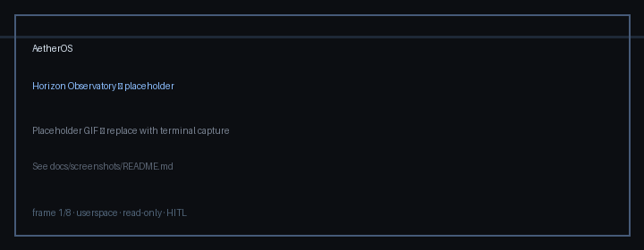
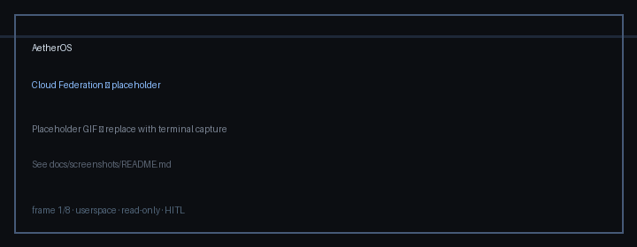
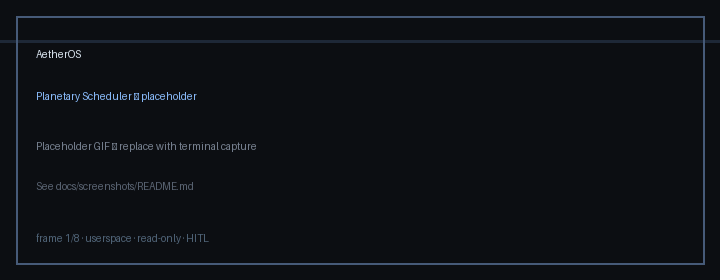
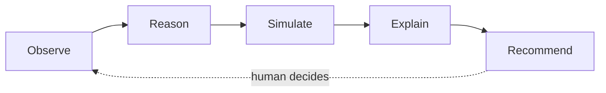
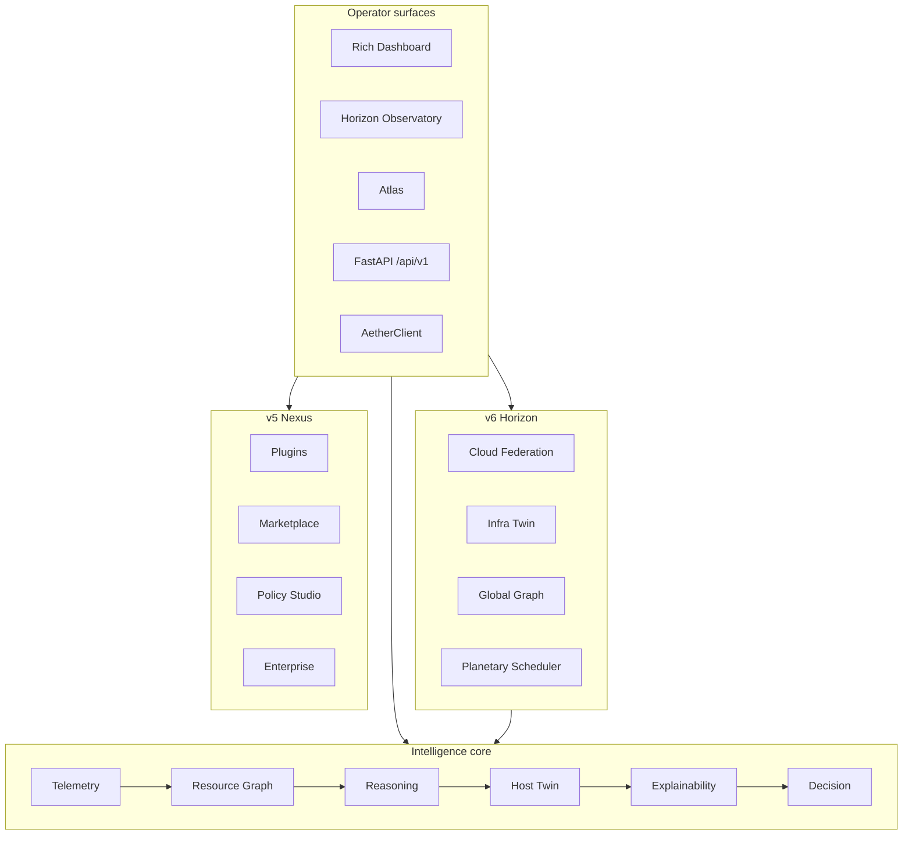

# AetherOS

**Explainable Operating Intelligence for Human-Centered Infrastructure**

**Observe · Reason · Simulate · Explain · Recommend**

[](https://github.com/ShouryaVeggalam/AetherOS/actions)
[](https://www.python.org/downloads/)
[](LICENSE)
[](docs/benchmarks.md)
[](docs/releases/v6.0.0.md)
[](https://github.com/Textualize/rich)

AetherOS turns host and multi-cloud telemetry into **trustworthy operator advice**.
It stays **userspace**, **read-only**, and **human-in-the-loop**.

It is **not** an operating system, kernel, hypervisor, or autonomous controller.
Humans always approve. No shell execution. No kubectl apply. No Terraform apply. No sudo.

---

## Why AetherOS

| Problem | AetherOS response |
|---------|-------------------|
| Metrics without narrative | Resource graphs + verified causal paths |
| Opaque AIOps scores | Evidence · confidence · reconstructible explanations |
| Dangerous autopilots | Simulation-first advice — never mutates live infra |
| Multi-cloud sprawl | Read-only federation census + planetary placement *recommendations* |

Built by **[CELESTRA](docs/CELESTRA.md)** under a research- and enterprise-grade charter.

| | |
|---|---|
| **Lineage** | v5 Nexus → **v6 Horizon** |
| **License** | MIT |
| **Paper** | [Explainable Operating Intelligence](docs/papers/aetheros_explainable_operating_intelligence.md) ([PDF](docs/papers/AetherOS_Explainable_Operating_Intelligence.pdf)) |

**Docs:** [Installation](docs/installation.md) · [Architecture](docs/architecture.md) · [Release notes](docs/releases/v6.0.0.md) · [Benchmarks](docs/benchmarks.md) · [Modules](docs/MODULES.md) · [Contributing](CONTRIBUTING.md) · [Security](SECURITY.md)

---

## Quick start

```bash
git clone https://github.com/ShouryaVeggalam/AetherOS.git
cd AetherOS
python3.12 -m venv .venv && source .venv/bin/activate
pip install -U pip && pip install -e ".[dev]"

python -m aetheros          # Rich operator dashboard
aetheros-horizon            # Horizon Observatory (global views)
aetheros-atlas              # Atlas presentation surface
uvicorn aetheros.api.app:app --reload   # read-only HTTP API
```

Full guide: **[docs/installation.md](docs/installation.md)** · Press `?` in the dashboard for help · `Q` to quit.

---

## Demo gallery

> Placeholder GIFs ship until maintainers record live captures.
> Capture guide: [docs/screenshots/README.md](docs/screenshots/README.md)

| Demo | Preview |
|------|---------|
| **Hero loop** |  |
| Operator dashboard |  |
| Horizon Observatory |  |
| Cloud Federation |  |
| Planetary Scheduler |  |
| Observatory |  |
| Cluster |  |
| Predictive |  |

---

## What's in Horizon (v6)

| Pillar | Package | One-liner |
|--------|---------|-----------|
| **P1 Cloud Federation** | `aetheros.cloud` | Read-only AWS · Azure · GCP · K8s · Docker · Edge census |
| **P2 Infra Twin** | `aetheros.infra_twin` | Clone · scenario · evaluate · diff (never live mutate) |
| **P3 Global Knowledge Graph** | `aetheros.global_graph` | Verified relationships + evidence |
| **P4 Planetary Scheduler** | `aetheros.planetary` | Top-5 placement *advice* only |
| **P5 Horizon Observatory** | `aetheros.horizon` | Rich global console (`aetheros-horizon`) |

Plus the full Nexus stack: Plugin SDK · Marketplace · Policy Studio · Enterprise · Public API / SDK · Resource Graph · Reasoning · Host Twin · Consensus · Federation · Atlas.

---

## Architecture

### Intelligence loop



### Platform stack (Horizon)



Deeper diagrams: [docs/architecture.md](docs/architecture.md) · [docs/architecture/](docs/architecture/) · [pipeline](docs/architecture/pipeline.md) · [generations](docs/architecture/generations.md) · [Horizon stack](docs/architecture/horizon-stack.md)

---

## Invariants (non-negotiable)

1. **Observe before acting.**
2. **Explain every recommendation.**
3. **Simulation before intervention advice.**
4. **Humans remain in control.**
5. **Userspace only** — no kernel modules, no privileged mutation APIs in core paths.

Feature gate: [CELESTRA charter](docs/CELESTRA.md)

---

## Keyboard map (dashboard)

| Key | Surface | Key | Surface |
|-----|---------|-----|---------|
| `?` | Help | `Q` | Quit |
| `C` | Cloud Federation | `I` | Infrastructure Twin |
| `K` | Global Knowledge Graph | `W` | Planetary Scheduler |
| `O` | Observatory | `Y` / `R` / `V` | Graph / Reasoning / Twin |
| `E` / `@` / `P` | Enterprise / Marketplace / Policy | `ESC` | Leave overlay |

Horizon Observatory (`aetheros-horizon`): **O C T K W D G R H** · **Q** quit.

---

## Project layout

```text
AetherOS/
├── aetheros/           # Platform packages (telemetry → horizon)
├── plugins/            # Plugin SDK examples
├── services/           # Optional cognition service
├── labs/               # Research labs
├── docs/               # Architecture · modules · releases · paper
├── tests/
├── scripts/            # Benchmarks · import-cycle checks
├── .github/            # CI · issue/PR templates
└── pyproject.toml
```

---

## Development

```bash
pip install -e ".[dev]"
ruff check .
black --check .
python scripts/check_import_cycles.py
pytest --cov=aetheros --cov-fail-under=90
python scripts/run_benchmarks.py
```

See [CONTRIBUTING.md](CONTRIBUTING.md) · [CODE_OF_CONDUCT.md](CODE_OF_CONDUCT.md) · [docs/benchmarks.md](docs/benchmarks.md)

---

## Roadmap

| Version | Focus |
|---------|--------|
| **v6.0 Horizon** | Cloud · Infra Twin · Global Graph · Planetary Scheduler · Observatory |
| v5.0 Nexus | Plugins · API/SDK · Marketplace · Policy · Enterprise |
| v4 Distributed | Federation · Topology · Scheduler · Atlas |
| v3 Cognitive | Memory · Causal KG · Consensus · Research Lab |
| v2 Intelligence | Resource Graph · Reasoning · Twin · Context |

---

## Community

- **Bugs / features** — [Issue templates](.github/ISSUE_TEMPLATE/)
- **PRs** — [Pull request template](.github/PULL_REQUEST_TEMPLATE.md)
- **Security** — [SECURITY.md](SECURITY.md) (private disclosure — not public issues)
- **Conduct** — [CODE_OF_CONDUCT.md](CODE_OF_CONDUCT.md)

---

## License

MIT © 2026 Shourya Veggalam — see [LICENSE](LICENSE).
