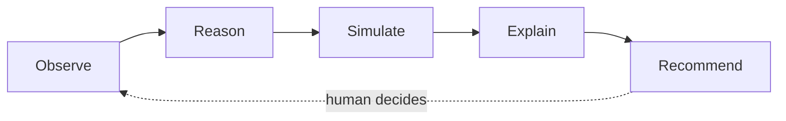
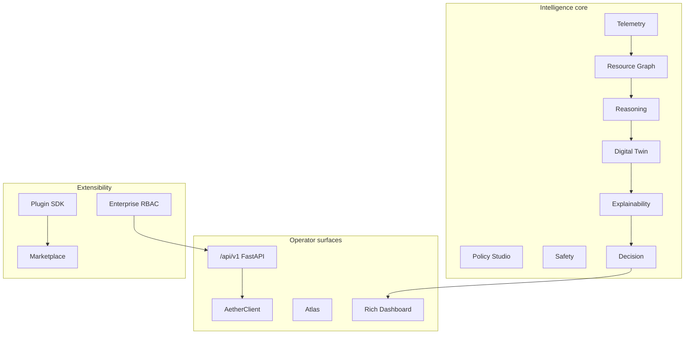
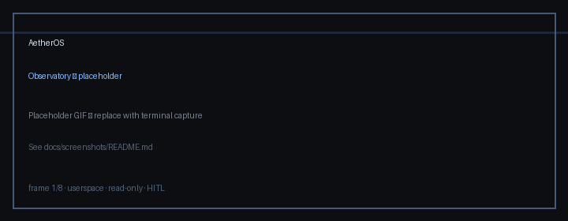
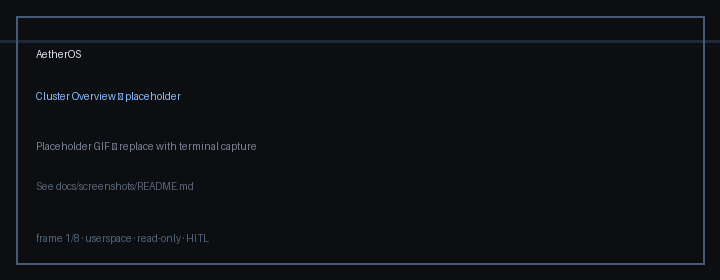
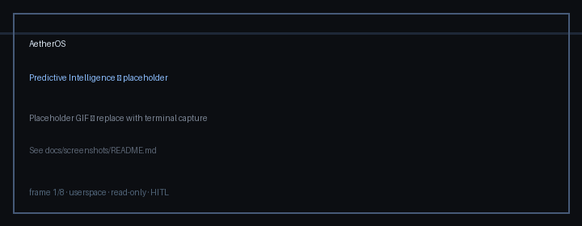
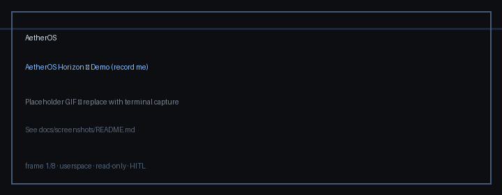

# AetherOS

**Explainable Operating Intelligence Platform**

**Observe · Reason · Simulate · Explain**

AetherOS turns telemetry into trustworthy operator advice while remaining entirely
**userspace**, **read-only**, and **human-in-the-loop**.

It is **not** an operating system, Linux distribution, kernel, device driver,
or autonomous controller. Humans always approve actions. No shell execution,
no kernel mutation, no sudo.

[](https://www.python.org/downloads/)
[](LICENSE)
[](pytest.ini)
[](.github/workflows/ci.yml)
[](https://github.com/Textualize/rich)
[](#installation)
[](#installation)
[](docs/releases/v5.0.0.md)

---

## Introduction

AetherOS is an **operator console for system intelligence**.

It collects local telemetry, evaluates policy, validates safety, ranks decisions,
records history, forecasts load, builds resource and causal graphs, runs digital-twin
simulations, federates topology views, hosts sandboxed plugins, exposes a public API
and Python SDK, and — for organizations — adds RBAC, API keys, and audit trails.

Every recommendation ships with **evidence**. Nothing is executed on your behalf.

| | |
|---|---|
| **Release** | `v5.0.0` |
| **Codename** | **Nexus** |
| **Status** | Production |
| **License** | MIT |
| **Team** | [CELESTRA](docs/CELESTRA.md) |

Docs: [Architecture](docs/architecture.md) · [Release notes](docs/releases/v5.0.0.md) · [Benchmarks](docs/benchmarks.md) · [Modules](docs/MODULES.md) · [Security](SECURITY.md) · [Contributing](CONTRIBUTING.md)

---

## Why AetherOS exists

Modern systems are observable. Few are *intelligible*.

Operators drown in metrics without a trustworthy narrative. Autopilots that mutate
hosts without explanation create risk. AetherOS sits in between:

- **Observe** — resource pressure in real time
- **Reason** — graph-backed hypotheses with confidence
- **Simulate** — twin and what-if outcomes without touching the OS
- **Explain** — evidence chains operators can reconstruct

---

## Features

| Capability | What it does |
|------------|--------------|
| **Telemetry & Safety** | Read-only `psutil` metrics, advice-only policy, audit log, cooldowns |
| **Decision & Observatory** | Prioritized recommendations + SQLite temporal memory |
| **Explainability & Predictive** | Evidence chains; statistical 5 / 15 / 60 minute forecasts |
| **Resource Graph & Reasoning** | Host resource graphs, traversal, verified hypotheses |
| **Digital Twin & Research** | Scenario simulation + research intelligence journals |
| **Cognition & Consensus** | Cognition core, causal knowledge, multi-agent consensus |
| **Federation & Topology** | Protocol snapshots, world→cluster topology, distributed scheduler advice |
| **Atlas Dashboard** | Presentation-layer Rich observatory (`aetheros-atlas`) |
| **Plugin SDK** | YAML manifests, capabilities, sandbox, Rich inspector |
| **Public API & SDK** | FastAPI `/api/v1` + `AetherClient` |
| **Marketplace** | Catalog · install · verify · enable (userspace) |
| **Policy Studio** | Versioned rules, simulate, advisory evaluation |
| **Enterprise** | Orgs, workspaces, RBAC, API keys, audit, compliance |
| **Horizon / Genesis / Sentinel / Fabric / Infinity** | Planetary, research, resilience, federation, unifying layers |

---

## Architecture

### Intelligence loop



### Platform stack (Nexus)



Deeper diagrams: [docs/architecture.md](docs/architecture.md) · [docs/architecture/](docs/architecture/)

---

## Screenshots & demo

> Terminal captures live under `docs/screenshots/`. Paths below are ready for GitHub rendering.








**Demo GIF placeholder** — record a 8–12s loop of the Nexus dashboard and save as
`docs/screenshots/demo.gif` (see [docs/screenshots/README.md](docs/screenshots/README.md)).



---

## Installation

Requires **Python 3.12+**. Supported on **Ubuntu**, **WSL2**, and **macOS**.

```bash
git clone https://github.com/shouryaveggalam/AetherOS.git
cd AetherOS

python3.12 -m venv .venv
source .venv/bin/activate   # macOS / Linux / WSL2

pip install -U pip
pip install -e ".[dev]"
```

### Quick start

```bash
# Rich operator dashboard
python -m aetheros
# or
aetheros

# Atlas presentation surface
aetheros-atlas

# Public API (read-only)
uvicorn aetheros.api.app:app --reload
```

Press `Q` to quit the dashboard. Press `?` for in-app help.

### Python SDK

```python
from aetheros import AetherClient, __version__

print(__version__)  # 5.0.0
client = AetherClient(base_url="http://127.0.0.1:8000")
health = client.health()
```

### Troubleshooting

| Symptom | Fix |
|---------|-----|
| `python: command not found` | Use `python3.12` explicitly |
| Blank / broken TUI in CI SSH | Run in a real TTY |
| `PermissionError` from `psutil` on macOS | Grant Full Disk Access to the terminal |
| No battery metrics | Expected on many desktops / VMs |
| Import errors after pull | Re-run `pip install -e ".[dev]"` |
| Coverage / CI red | `pytest --cov=aetheros --cov-fail-under=90` |

---

## Keyboard shortcuts

| Key | Action |
|-----|--------|
| `Q` | Quit |
| `?` | Help |
| `I` | Infinity (platform overview) |
| `E` | Enterprise |
| `@` | Extensions / Marketplace |
| `P` | Policy Studio |
| `#` | Predictive Intelligence |
| `=` | Explainability |
| `O` | Observatory |
| `Y` | Resource Graph |
| `R` | Graph Reasoning |
| `V` | Digital Twin |
| `X` | Research Intelligence |
| `L` | Operational Memory |
| `N` | Causal Knowledge Graph |
| `J` | Multi-Agent Consensus |
| `B` | Research Lab |
| `U` | Federation Protocol |
| `Z` | Cluster Topology |
| `/` | Distributed Scheduler |
| `F` | Fabric |
| `S` | Sentinel |
| `G` | Genesis |
| `H` | Horizon |
| `M` | Multi-Agent View |
| `K` | Cognitive Graph |
| `C` | Cloud Federation |
| `;` | Cluster overview |
| `W` | Workload Planner |
| `A` | Run autonomous research |
| `D` | Developer / plugin console |
| `1`–`6` | Switch intent profile |
| `ESC` | Leave overlays |

---

## Project structure

```text
AetherOS/
├── aetheros/           # Core platform packages
│   ├── api/ · sdk/     # Public API + AetherClient
│   ├── enterprise/     # Orgs, RBAC, keys, audit
│   ├── marketplace/    # Extension catalog
│   ├── policy/         # Policy Studio
│   ├── dashboard/      # Rich operator UI
│   └── …               # telemetry → infinity stack
├── plugins/            # Plugin SDK + examples
├── services/           # CELESTRA GII cognition service
├── labs/               # Aether Lab (research)
├── docs/               # Architecture, modules, releases
├── tests/
├── .github/            # CI, templates, funding
└── pyproject.toml
```

---

## Philosophy

Built by **CELESTRA** under a research- and enterprise-grade charter:

1. **Observe before acting.**
2. **Explain every recommendation.**
3. **Simulation before intervention.**
4. **Humans remain in control.**

Every feature must be problem-backed, evidence-based, explainable, tested, and
reproducible. Systems quality outranks flashy UI.

Charter: [docs/CELESTRA.md](docs/CELESTRA.md)

---

## Roadmap

| Version | Focus |
|---------|--------|
| **v5.0.0 Nexus** | Plugin SDK · Public API · Marketplace · Policy Studio · Enterprise |
| **v6.x (in progress)** | Cloud Federation Engine (read-only multi-cloud) |
| v4.x | Federation · Topology · Scheduler · Atlas |
| v3.x | Cognition · Memory · Causal KG · Consensus · Research Lab |
| v2.0 Intelligence | Resource Graph · Reasoning · Twin · Context · Research Intel |
| **Horizon (next)** | Planetary overlays, recorded demos, optional read-only WS transport |

See [docs/horizon.md](docs/horizon.md) and [CHANGELOG.md](CHANGELOG.md).

---

## Contributing

We welcome careful, well-tested contributions.

1. Read [CONTRIBUTING.md](CONTRIBUTING.md) and [CODE_OF_CONDUCT.md](CODE_OF_CONDUCT.md).
2. Open issues with the templates under [`.github/ISSUE_TEMPLATE/`](.github/ISSUE_TEMPLATE/).
3. Keep PRs focused; preserve userspace / read-only / HITL invariants.

```bash
pip install -e ".[dev]"
ruff check .
black --check .
pytest --cov=aetheros --cov-fail-under=90
```

Security reports: [SECURITY.md](SECURITY.md) (not public issues).

---

## License

MIT © 2026 Shourya Veggalam — see [LICENSE](LICENSE).
