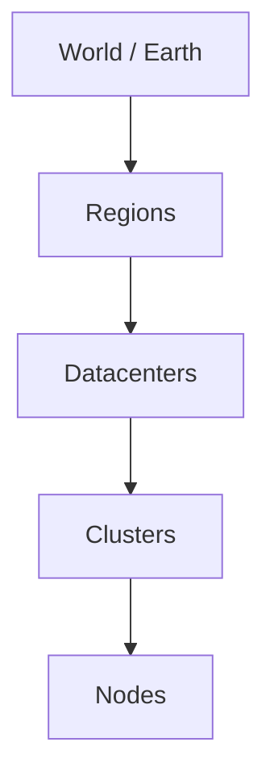

# Atlas (v5)

Global infrastructure reasoning facade.

Atlas maps to the existing Horizon world graph and Global Twin. It does
**not** introduce a second planetary model.

## Hierarchy



## Public API

```python
from aetheros.atlas import WorldGraph, HorizonRuntime, GlobalTwin
```

## Invariants

- Read-only / simulation-only
- No remote execution
- Humans approve recommendations
