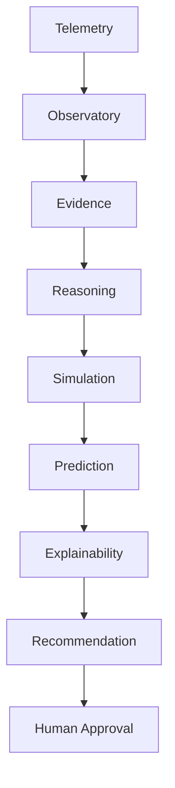
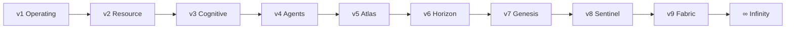

# AetherOS ∞ — Infinity

Unifying layer for the Explainable Operating Intelligence Platform.

## Identity

AetherOS is **not** an OS, kernel, driver, or autonomous controller.
It observes, explains, predicts, and simulates — humans approve.

## Intelligence pipeline



## Generations



## Public API

```python
from aetheros.infinity import InfinityRuntime, GENERATIONS, PIPELINE

report = InfinityRuntime().observe()
```

## Invariants

- Preserve all prior versions
- No circular dependencies into Infinity from lower layers
- Recommendation / simulation only
