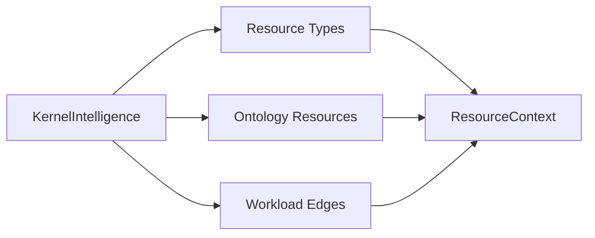

# Kernel Intelligence (userspace)

**This is not a Linux/BSD kernel module.**

`aetheros.kernel` exposes a read-only **resource context** catalog used by
planners and cognition. It never modifies kernel state and never requires
sudo.

## Architecture



## Public API

```python
from aetheros.kernel import KernelIntelligence

ctx = KernelIntelligence().context()
```

## Invariants

- Userspace only
- Read-only catalogs
- No syscalls that mutate the OS
