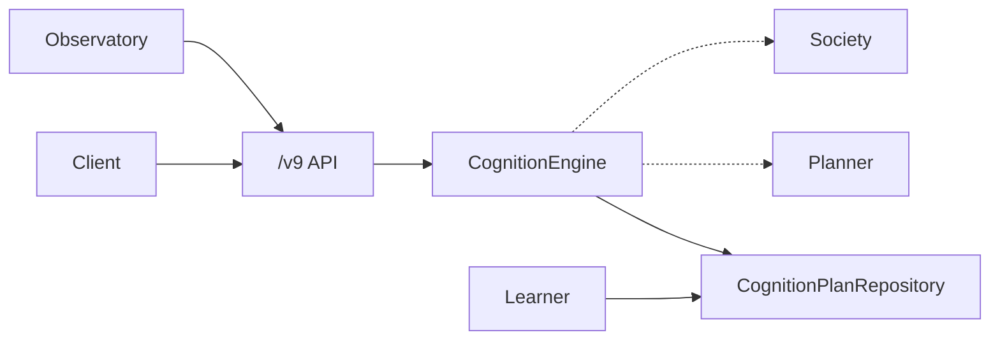

# Phase 16 / LI v9.0 — General Intelligence Infrastructure (GII)

**Status:** Module 1 (Cognition Engine) complete  
**Package:** [`services/intelligence/`](../services/intelligence/)  
**HTTP:** `/v9/*`

---

## Philosophy

This is **not** AGI. This is **not** a frontier foundation model. This is **not** an autonomous chatbot.

CELESTRA GII is the infrastructure that enables persistent, scalable, explainable, and continuously improving intelligence. Foundation models remain interchangeable compute engines. CELESTRA owns memory, reasoning, knowledge, decision-making, agents, governance, learning, and orchestration.

```
Perception → Knowledge → Memory → Reasoning → Decision
  → Execution → Outcome → Learning → Improved Intelligence
```

Every completed task improves future intelligence. Historical knowledge is immutable.

---

## Package layout

```
services/intelligence/
  cognition/       # Module 1 ✓
  planner/         # Module 2 — hierarchical planning
  learner/         # Module 3 — post-execution learning
  society/         # Module 4 — agent societies
  memory/          # Module 5 — meta / lifelong memory
  knowledge/
  reasoning/
  decisions/
  execution/
  observatory/     # Intelligence Observatory surfaces
  models/          # Shared frozen domain types
  repositories/    # Append-only stores
  api/             # /v9 FastAPI routers
  migrations/      # li_gii_* schema
  tests/
  runtime.py       # IntelligenceRuntime composition root
```

---

## Module 1 — Cognition Engine (complete)

**Path:** `services/intelligence/cognition/`

| File | Role |
|------|------|
| `decompose.py` | Recursive objective tree from goal + constraints |
| `complexity.py` | Complexity score and tier |
| `allocate.py` | Agent + knowledge allocation (evidence-gated) |
| `service.py` | `CognitionEngine.understand` → immutable `CognitionPlan` |

### Inputs

`goal` · `context` · `constraints` · `workspace_id` · `created_by`

### Outputs

`CognitionPlan` — decomposition · complexity · required agents · required knowledge · execution steps · confidence

### Persistence

Append-only `InMemoryCognitionPlanRepository`. Forward schema: Alembic-style [`migrations/0012_general_intelligence_cognition.py`](../services/intelligence/migrations/0012_general_intelligence_cognition.py) → `li_gii_cognition_plans` (UUID PK).

### API

| Method | Path | Behavior |
|--------|------|----------|
| `POST` | `/v9/cognition` | Create cognition plan |
| `GET` | `/v9/cognition/{id}` | Fetch plan |
| `GET` | `/v9/cognition` | List by workspace |
| `GET` | `/v9/intelligence` | Intelligence health aggregate |

### Exit criteria

- [x] Frozen domain models
- [x] Deterministic, model-agnostic engine (no LLM calls)
- [x] Evidence-gated agent/knowledge allocation
- [x] Append-only repository + snapshot immutability
- [x] `/v9/cognition` + `/v9/intelligence` OpenAPI
- [x] Colocated unit + API tests

---

## Module backlog

| Module | Surface | Status |
|--------|---------|--------|
| 2 Planner | `POST /v9/plan` | Stub package |
| 3 Learner | `POST /v9/learn` | Stub package |
| 4 Society | `GET /v9/societies` | Stub package |
| 5 Meta Memory | `GET /v9/memory/consolidation` | Stub package |
| 6 Workflows | `POST /v9/workflows` | Stub package |
| Observatory | Cognition / Planner / Societies / Memory / Learning / Decisions / Reasoning / Performance | Stub package |

---

## Integration map



GII does **not** rewrite existing AetherOS telemetry, prediction, reasoning, simulation, dashboard, or database modules. Optional adapters only.

---

## Non-goals

- Autonomous OS mutation
- Overwriting historical plans or evaluations
- Binding a single foundation model into the cognition loop
- Fake 200 responses for unimplemented `/v9` modules
