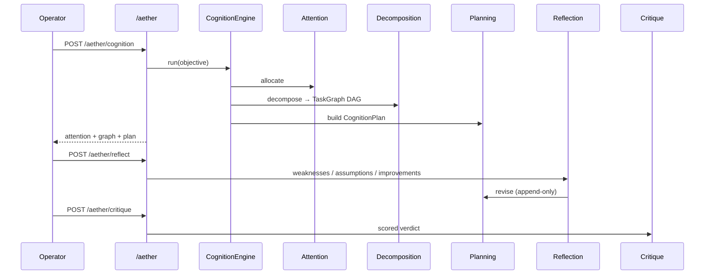
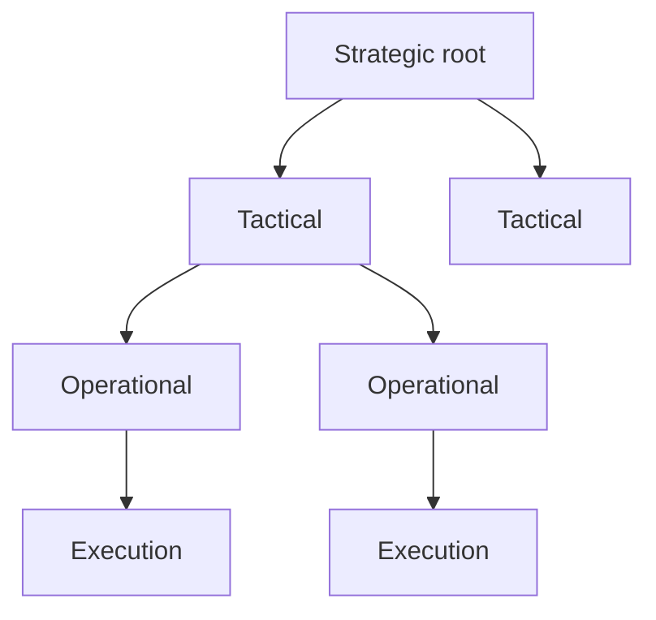

# Aether Lab — Cognitive Architecture (CELESTRA X)

**Package:** [`labs/aether/`](../labs/aether/)  
**HTTP:** `/aether/*`  
**Modules:** Attention · Decomposition · Planning · Reflection · Critique

---

## Philosophy

Aether is the **executive cognitive system** of CELESTRA. Foundation models remain interchangeable inference engines.

---

## Module map

| Module | Responsibility |
|--------|----------------|
| **Attention** | Adaptive weights + reasoning/retrieval budgets |
| **Decomposition** | Strategic → Tactical → Operational → Execution DAG |
| **Planning** | CognitionPlan from attention + graph; revise path |
| **Reflection** | Logical gaps, assumptions, ambiguity, missing evidence |
| **Critique** | correctness · completeness · consistency · evidence · calibration |

---

## Decomposition levels

Sibling tasks carry sequential dependencies; parent edges enforce hierarchy. Topological order is Kahn-stable and cycle-checked.

---

## Reflection → Critique loop

1. Operator supplies `reasoning_summary` + optional evidence  
2. Reflection extracts weaknesses / assumptions / improvements  
3. Optional revised plan appended (`status=revised`, `parent_plan_id`)  
4. Critique returns machine-readable scores + `pass|revise|reject`

---

## Observatory

| Page | Feature |
|------|---------|
| Cognition | Stage replay |
| Attention Map | Channel heatmap |
| Task Graph | Hierarchical DAG |
| Reflection | Assumption explorer + timeline |
| Critique | Criterion scores |

Path: `labs/aether/observatory/web`

---

## Exit criteria

- [x] Frozen typed models including `TaskGraph`
- [x] Deterministic Attention + Decomposition + Planning
- [x] Reflection + Critique with append-only stores
- [x] FastAPI `/aether` OpenAPI routes
- [x] Observatory pages for all five views
- [x] Unit + API tests (≥95% on cognitive core)
