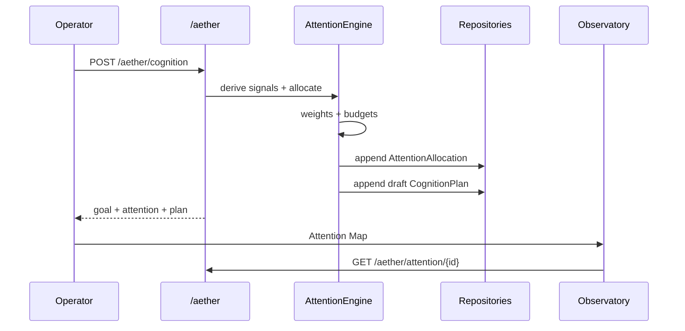
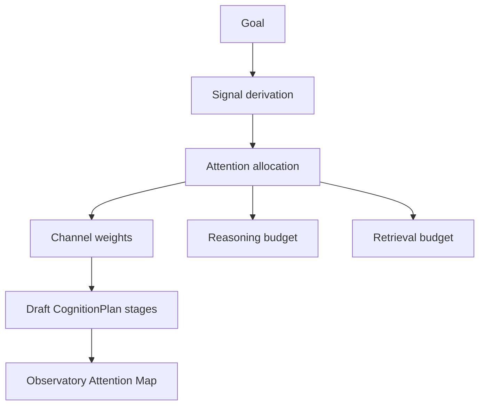

# Aether Lab — Cognitive Architecture (CELESTRA X)

**Package:** [`labs/aether/`](../labs/aether/)  
**HTTP:** `/aether/*`  
**Module 1:** Attention Engine

---

## Philosophy

Aether is the **executive cognitive system** of CELESTRA. It allocates attention, decomposes problems, plans hierarchically, reflects, critiques, and revises reasoning.

It is **not** a foundation model, chain-of-thought generator, or agent framework. Foundation models remain interchangeable inference engines.

---

## Scientific workflow (Module 1)

### Channel semantics

| Channel | Role |
|---------|------|
| `focus` | Deep work on the primary objective |
| `memory` | Retrieve relevant prior evidence |
| `exploration` | Broaden search under uncertainty / scarce context |
| `verification` | Check assumptions and evidence quality |

Allocation is a closed-form deterministic function of normalized signals — identical inputs always yield identical weights and budgets.

---

## API (OpenAPI `/docs`)

| Endpoint | Module |
|----------|--------|
| `POST /aether/attention` | 1 Attention |
| `GET /aether/attention/{id}` | 1 |
| `POST /aether/cognition` | 1 draft plan |
| `GET /aether/plans/{id}` | 1 |
| `POST /aether/decompose` | pending |
| `POST /aether/reflect` | pending |
| `POST /aether/critique` | pending |

---

## Observatory pages

| Page | Status |
|------|--------|
| Cognition | Shell + API draft plans |
| Attention Map | Module 1 live |
| Task Graph | Awaits Decomposition |
| Reflection | Awaits Reflection Engine |
| Critique | Awaits Critique Engine |

Path: `labs/aether/observatory/web`

---

## Exit criteria (Module 1)

- [x] Frozen typed models (`Goal`, `Attention*`, `CognitionPlan`, `Task`, `Reflection`, `Critique`)
- [x] Deterministic Attention Engine with explainable factors
- [x] Async repository pattern (in-memory + PostgreSQL migration)
- [x] FastAPI `/aether` routes + OpenAPI tags
- [x] Observatory Attention Map (Next.js 16 scaffold)
- [x] Unit + API tests
