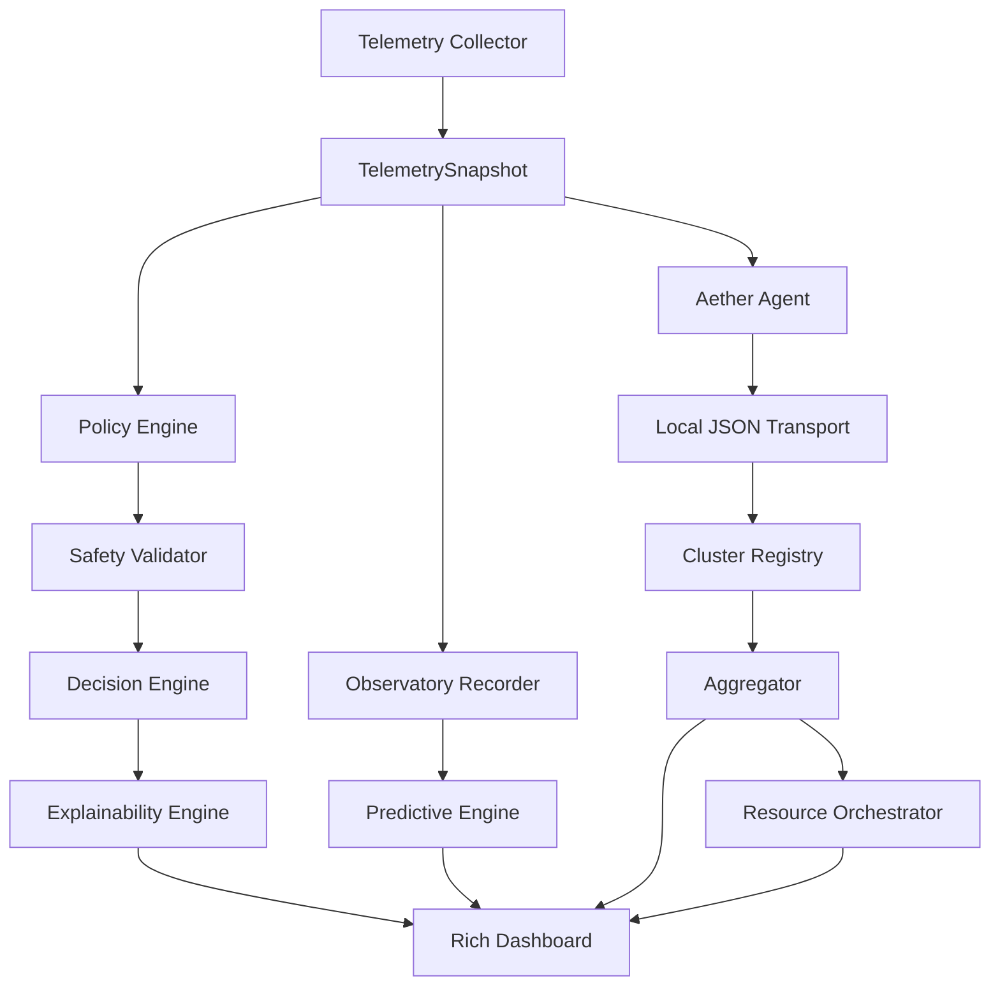

# Architecture

AetherOS is a **userspace** operating intelligence platform. Every subsystem produces advice, evidence, or visualization. None of them mutate the kernel or execute remote commands.

## Design invariants

1. **Read-only by default** — telemetry via `psutil`; no sudo; no SSH automation.
2. **Explainable outputs** — recommendations carry evidence, not opaque scores alone.
3. **Human-in-the-loop** — the dashboard recommends; operators decide.
4. **Separation of concerns** — collection, analysis, and Rich rendering stay in separate modules.

## Pipeline

## Module map

| Package | Responsibility |
|---------|----------------|
| `telemetry` | Host metrics and process samples |
| `policy_engine` | Rule-based recommendations |
| `safety` | Approval, cooldowns, SQLite audit |
| `decision` | Prioritization into one `Decision` |
| `intent` | Operator profile weights |
| `learning` | Historical pattern summaries |
| `simulation` | What-if scoring without side effects |
| `research` | Strategy generation and ranking |
| `sdk` / `plugins` | Sandboxed plugin loading |
| `observatory` | Temporal memory + events |
| `explainability` | Evidence and confidence |
| `predictive` | Statistical forecasts |
| `cluster` / `agent` | Multi-device bus |
| `orchestrator` | Workload placement plans |
| `dashboard` | Rich Live operator console |

## Data principles

- Prefer **frozen dataclasses** for snapshots, plans, and evidence.
- Persist audits and history in **SQLite** under `data/` (gitignored).
- Transports speak **JSON** so WebSocket can replace the local bus later without changing payloads.

## Related docs

- [Observatory](observatory.md)
- [Explainability](explainability.md)
- [Cluster](cluster.md)
