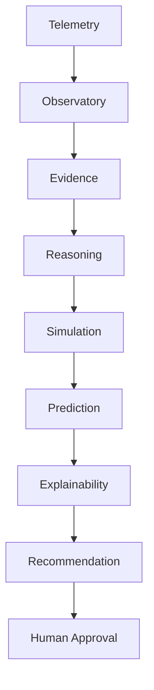
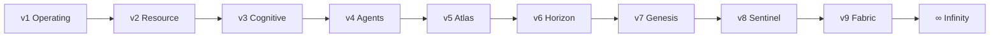

# Architecture — AetherOS ∞

AetherOS is an **Explainable Operating Intelligence Platform**. It is not an
operating system, kernel, driver, or autonomous controller.

Engineering decisions follow the **CELESTRA** founding charter:
[CELESTRA.md](CELESTRA.md) (human-centered, explainable, simulation-first,
read-only, open architecture, enterprise-grade).

## Design invariants

1. Observe before acting.
2. Explain every recommendation.
3. Simulation before intervention.
4. Humans remain in control.
5. Immutable telemetry.
6. Research-grade architecture.
7. Modular by design — no circular dependencies into higher layers.

## Intelligence pipeline

## Generation map

## Module map

| Package | Generation | Responsibility |
|---------|------------|----------------|
| `telemetry` | v1 | Host metrics (read-only) |
| `policy` / `policy_engine` | v1 | Advice-only rules |
| `safety` | v1 | Approval, cooldowns, audit |
| `decision` | v1 | Prioritized recommendations |
| `observatory` | v1 | Temporal memory |
| `explainability` | v1 | Evidence + confidence |
| `predictive` | v1+ | Statistical forecasts |
| `cluster` / `agent` | v1+ | Multi-device bus |
| `orchestrator` | v1+ | Workload placement advice |
| `kernel` | v2 | **Userspace** resource context (not OS kernel) |
| `knowledge` / `ontology` | v2–v7 | Catalogs and relations |
| `cognition` / `reasoning` | v3 | Causal / hypothesis / verify |
| `agents` / `messaging` | v4 | Multi-agent bus |
| `atlas` | v5 | Facade over Horizon + Twin |
| `horizon` / `edge` / `robotics` | v6 | Planetary intelligence |
| `genesis` | v7 | Research knowledge engine |
| `sentinel` / `graph` | v8 | Resilience intelligence |
| `fabric` / `protocol` / `twin` | v9 | Universal federation |
| `infinity` | ∞ | Unifying pipeline + status |
| `api` / `dashboard` | all | Read-only API + Rich UI |

## Compatibility aliases

- `aetheros.policy` → `aetheros.policy_engine`
- `aetheros.atlas` → Horizon world graph + Global Twin
- `aetheros.kernel` → userspace resource context only

## Related docs

- [CELESTRA charter](CELESTRA.md)
- [Infinity](infinity.md)
- [Module index](MODULES.md)
- [Fabric](fabric.md) · [Sentinel](sentinel.md) · [Genesis](genesis.md) · [Horizon](horizon.md)
- [Agents](agents.md) · [Cognition](cognition.md) · [Observatory](observatory.md)
