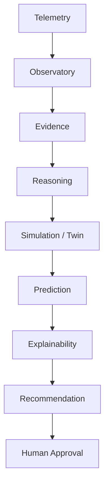
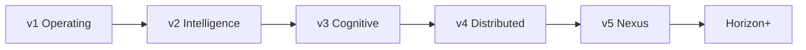

# Architecture — AetherOS v6 Horizon

AetherOS is an **Explainable Operating Intelligence Platform**. It is not an
operating system, kernel, driver, or autonomous controller.

Engineering decisions follow the **CELESTRA** founding charter:
[CELESTRA.md](CELESTRA.md) (human-centered, explainable, simulation-first,
read-only, open architecture, enterprise-grade).

**Release line:** `v6.0` · **Codename:** **Horizon** (extends **v5.0.0 Nexus**) · **License:** MIT  
**Install:** [installation.md](installation.md) · **Release notes:** [releases/v6.0.0.md](releases/v6.0.0.md)

## Design invariants

1. Observe before acting.
2. Explain every recommendation.
3. Simulation before intervention.
4. Humans remain in control.
5. Immutable telemetry.
6. Research-grade architecture.
7. Modular by design — no circular dependencies into higher layers.

## Diagram index

| Diagram | File |
|---------|------|
| Intelligence pipeline | [architecture/pipeline.md](architecture/pipeline.md) |
| Platform stack (Nexus) | [architecture/platform-stack.md](architecture/platform-stack.md) |
| **Horizon stack (v6)** | [architecture/horizon-stack.md](architecture/horizon-stack.md) |
| Extensibility & enterprise | [architecture/extensibility.md](architecture/extensibility.md) |
| Generation map | [architecture/generations.md](architecture/generations.md) |

## Intelligence pipeline

## Generation map

## Module map

| Package | Generation | Responsibility |
|---------|------------|----------------|
| `telemetry` | v1 | Host metrics (read-only) |
| `policy_engine` | v1 | Advice-only rules (legacy engine) |
| `policy` | v5 | Policy Studio (versioned · simulate · advisory) |
| `safety` | v1 | Approval, cooldowns, audit |
| `decision` | v1 | Prioritized recommendations |
| `observatory` | v1 | Temporal memory |
| `explainability` | v1 | Evidence + confidence |
| `predictive` | v1+ | Statistical forecasts |
| `cluster` / `agent` | v1+ | Multi-device bus |
| `orchestrator` | v1+ | Workload placement advice |
| `graph` / `bridge` / `reasoning` | v2 | Resource graph + reasoning |
| `twin` / `context` / `research` | v2 | Twin · context · research intel |
| `memory` / `knowledge` / `cognition` | v3 | Operational memory · causal KG · cognition core |
| `research_ai` | v3 | Autonomous research lab (twin-only) |
| `federation` / `topology` / `scheduler` | v4 | Protocol · topology · scheduler advice |
| `atlas` | v4–v5 | Rich presentation observatory |
| `marketplace` | v5 | Extension catalog · install · verify |
| `enterprise` | v5 | Orgs · RBAC · API keys · audit · compliance |
| `api` / `sdk` | v5 | `/api/v1` + `AetherClient` |
| `horizon` / `edge` / `robotics` | v6 | Planetary intelligence |
| `genesis` | v7 | Research knowledge engine |
| `sentinel` | v8 | Resilience intelligence |
| `fabric` / `protocol` | v9 | Universal federation |
| `simulation` | [simulation.md](simulation.md) | Host what-if (simulator family) |
| `storage` | architecture | Shared SQLite helpers |
| `infinity` | ∞ | Unifying pipeline + status |
| `dashboard` | all | Rich operator UI |
| `plugins` / Plugin SDK | all | Sandboxed plugins |
| `services/intelligence` | GII | Cognition Engine — see [PHASE16.md](PHASE16.md) |

## Compatibility notes

- `aetheros.policy` is the **Policy Studio** package (v5). Legacy advice-only evaluation remains in `aetheros.policy_engine`.
- `aetheros.kernel` is **userspace** resource context only — never an OS kernel.
- `aetheros.advice.Decision` is shared by decision + intent (no package cycle).
- `aetheros.sdk.client.AetherClient` is the supported public Python client.

## Related docs

- [CELESTRA charter](CELESTRA.md)
- [Module index](MODULES.md)
- [Plugin SDK](plugin_sdk.md) · [Public API](public_api.md) · [Python SDK](python_sdk.md)
- [Marketplace](marketplace.md) · [Policy Studio](policy_studio.md) · [Enterprise](enterprise.md)
- [Benchmarks](benchmarks.md) · [Release notes v5.0.0](releases/v5.0.0.md)
- [Horizon roadmap](horizon.md)
