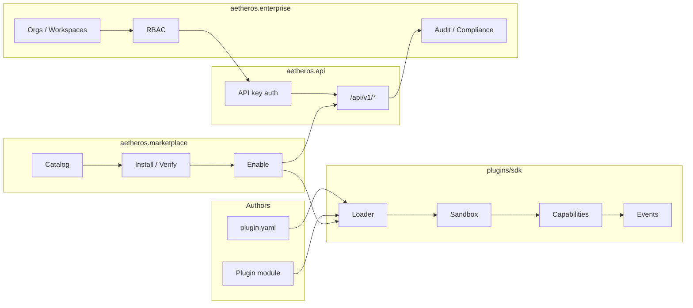

# Architecture diagram — Extensibility & enterprise

How plugins, marketplace, public API, and enterprise controls relate in **v5.0.0 Nexus**.

## Trust model

1. Manifests declare capabilities; the sandbox deny-list blocks dangerous imports.
2. Marketplace verify/enable is advisory and local — no remote code execution by default.
3. Enterprise audit logs are append-oriented; they do not grant shell or sudo.
4. Untrusted plugins must not be enabled in production.

See [plugin_sdk.md](../plugin_sdk.md), [marketplace.md](../marketplace.md), [enterprise.md](../enterprise.md).
