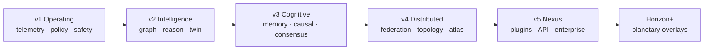
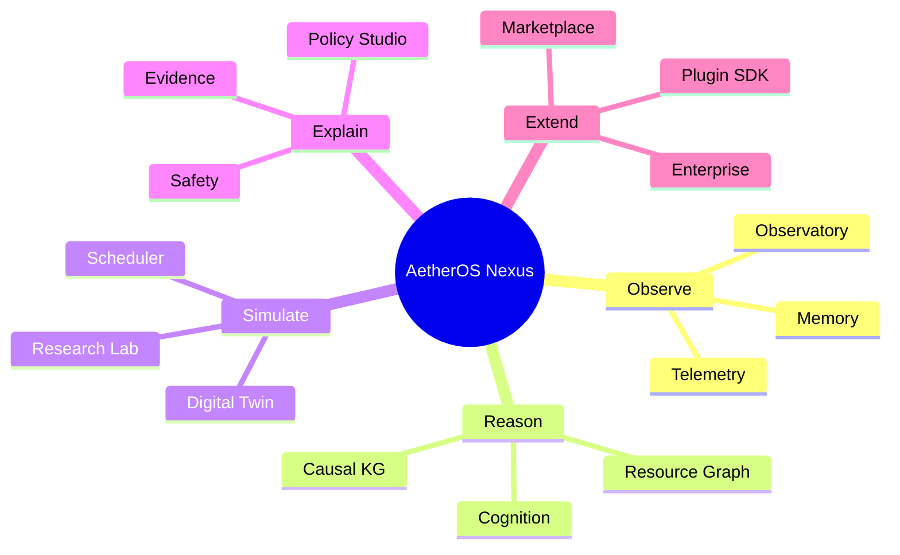

# Architecture diagram — Generations

Historical generation labels used across AetherOS documentation, aligned to the
**v5.0.0 Nexus** production release.

Legacy generation names (Horizon / Genesis / Sentinel / Fabric / Infinity) remain
as packages and dashboard surfaces; they are not superseded by Nexus packaging.
