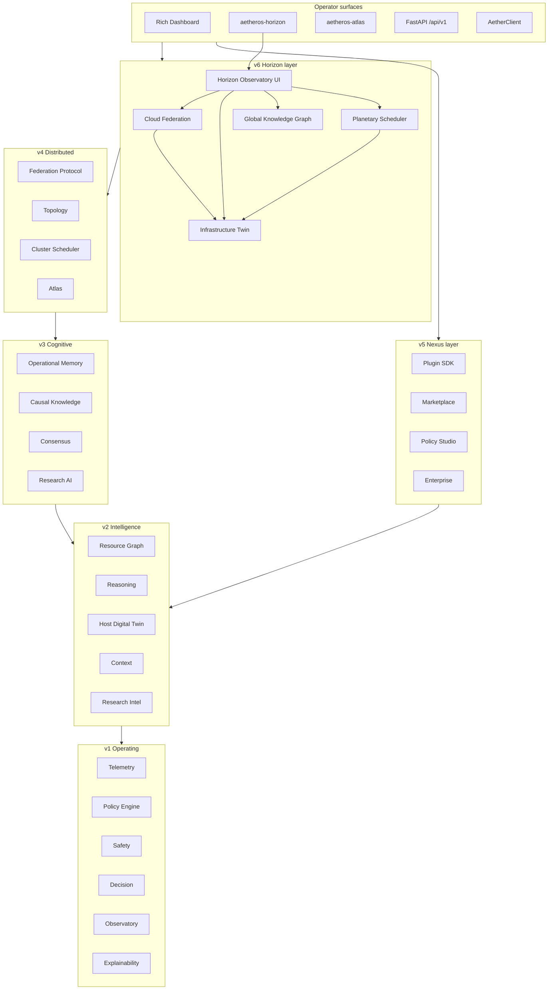
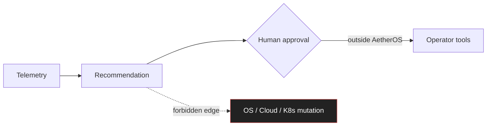

# Architecture diagram — Horizon stack (v6)

Layered view of **AetherOS v6 Horizon** as consumed by operators and integrations.
Companion to [platform-stack.md](platform-stack.md) (Nexus) and [generations.md](generations.md).

## Operator → intelligence flow

## Safety boundary

## Related docs

- [architecture.md](../architecture.md) — narrative overview
- [pipeline.md](pipeline.md) — intelligence pipeline
- [generations.md](generations.md) — generation map
- [extensibility.md](extensibility.md) — plugins · API · enterprise
- [cloud_federation.md](../cloud_federation.md)
- [infrastructure_twin.md](../infrastructure_twin.md)
- [global_knowledge_graph.md](../global_knowledge_graph.md)
- [planetary_scheduler.md](../planetary_scheduler.md)
- [horizon_observatory.md](../horizon_observatory.md)
