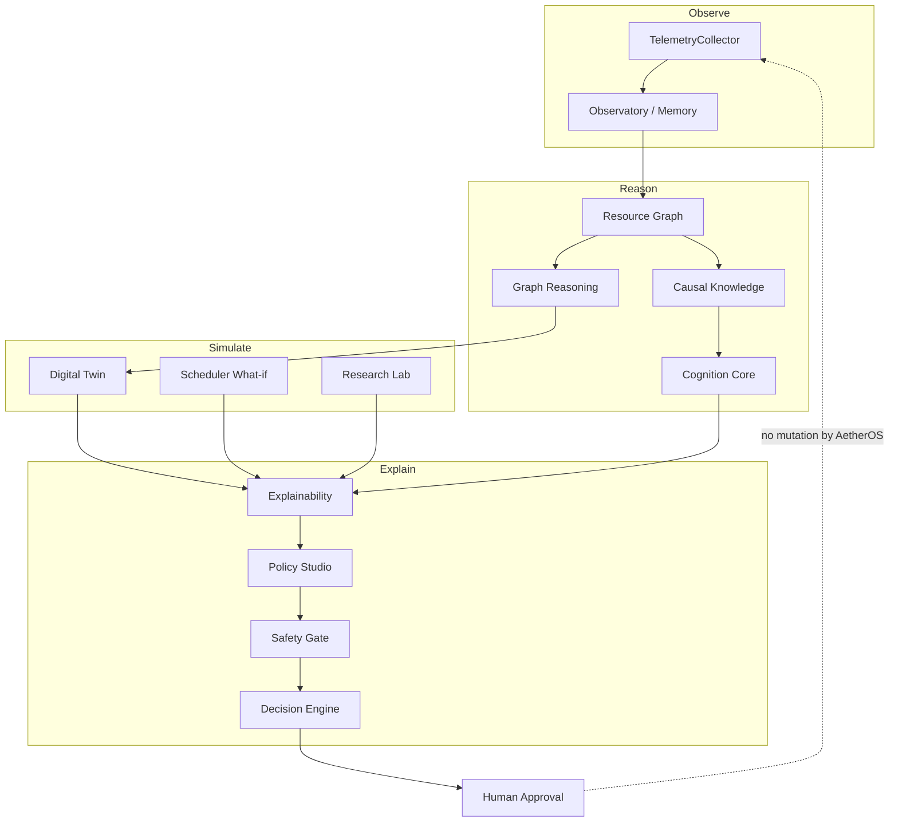

# Architecture diagram — Intelligence pipeline

Mermaid source for the AetherOS **Observe → Reason → Simulate → Explain** loop
shipped with **v5.0.0 Nexus**.

## Invariants

- All edges are **read-only** with respect to the host OS.
- Simulation never writes kernel or process state.
- Recommendations require human approval outside AetherOS.
