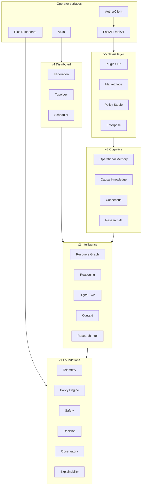

# Architecture diagram — Platform stack (Nexus)

Layered view of **AetherOS v5.0.0 Nexus** packages as consumed by operators and integrations.

## Notes

- Surfaces never bypass Safety / HITL for host mutation (AetherOS has no mutation path).
- Enterprise middleware authenticates API access; it does not expand privileges on the host OS.
