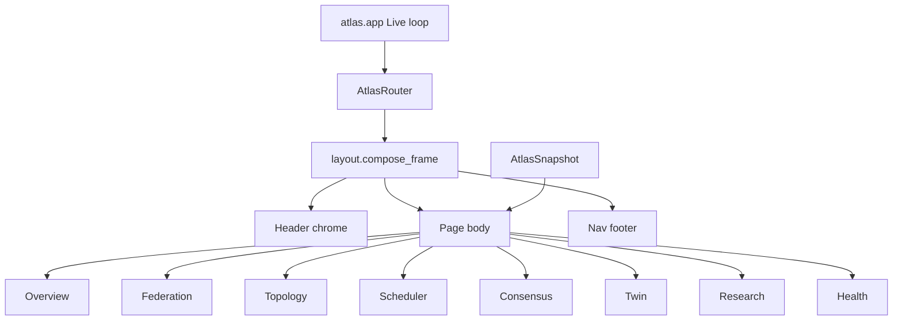
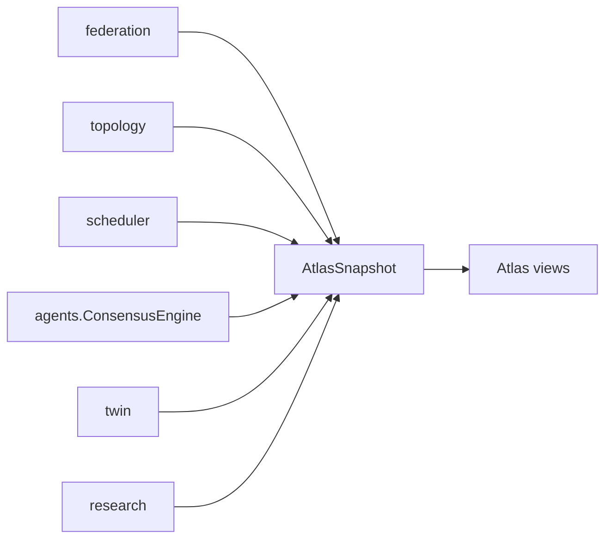

# Atlas Dashboard — AetherOS v4.0 P5

**Package:** [`aetheros/atlas/`](../aetheros/atlas/)  
**Entry:** `aetheros-atlas` · `python -m aetheros.atlas`  
**Status:** Presentation layer only (Rich · read-only)

---

## Philosophy

Atlas is a **premium terminal observatory** over distributed infrastructure.
It answers health, pressure, twin predictions, consensus, and discoveries.

| Allowed | Forbidden |
|---------|-----------|
| Consume existing APIs / immutable models | Modify telemetry collectors |
| Rich Panels / Tables / Trees | Textual |
| Keyboard navigation | Mutate Digital Twin live state |
| Demo snapshot seeding | Change database schema |
| | Alter reasoning / consensus engines |

---

## Navigation

| Key | Page |
|-----|------|
| **O** | Overview |
| **F** | Federation |
| **T** | Topology |
| **S** | Scheduler |
| **G** | Global Consensus |
| **D** | Digital Twin |
| **R** | Research |
| **H** | Health |
| **Q** | Quit |

Router is modular (`AtlasRouter`) — page renderers are registered independently.

---

## Layout architecture





---

## Widget system

| Widget | Role |
|--------|------|
| `StatCard` | Metric tile |
| `AtlasProgressBar` | 0–100 utilization bar |
| `AtlasTree` / `TreeNodeSpec` | Hierarchy tree |
| `AtlasTable` | Columnar grids |
| `AtlasSparkline` | Compact series spark |

All widgets are frozen dataclasses implementing `__rich__`.

---

## Pages

- **Overview** — connected nodes, online %, cluster health, CPU/MEM/DISK, discoveries, simulations, consensus
- **Federation** — registry table (node, version, status, heartbeat age, protocol)
- **Topology** — Rich Tree World → Regions → DCs → Clusters → Nodes
- **Scheduler** — candidates, scores, latency, utilization, trade-offs (simulation only)
- **Global Consensus** — findings, supporting nodes, conflicts, quorum, recommendation, confidence
- **Digital Twin** — scenario, current vs simulated, diff, stability, risk, reasoning
- **Research** — daily report, trends, discoveries, evidence, journal
- **Health** — green / yellow / red subsystem board

---

## Screenshot placeholders

> Placeholder — Overview with stat cards and resource bars  
> Placeholder — Topology Rich Tree (WORLD → regions → nodes)  
> Placeholder — Health board (● green / yellow / red)

Run locally:

```bash
aetheros-atlas
# or
python -m aetheros.atlas --page overview
```

---

## Compatibility

`aetheros.atlas` still re-exports the historical Horizon / Global Twin facade
(`WorldGraph`, `HorizonRuntime`, `GlobalTwin`, …) used by earlier generations.
