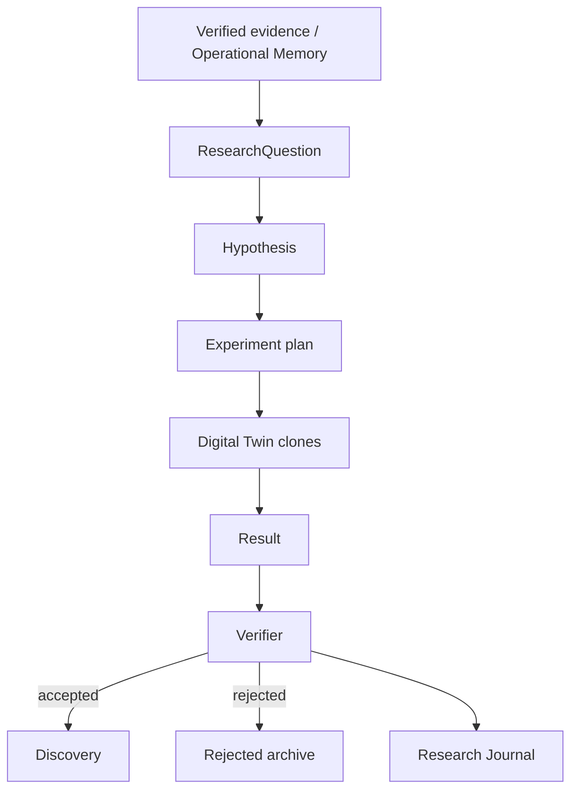
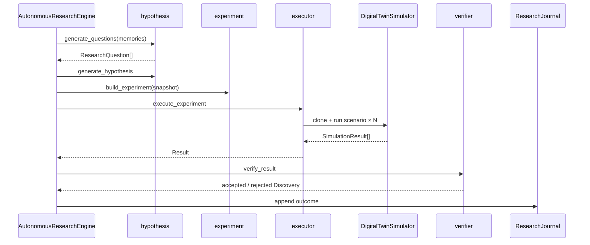

# Autonomous Research Engine (v3.0 P5)

Scientific research engine that generates hypotheses, runs **Digital Twin**
experiments, verifies reproducibility, and journals discoveries.

**Not autonomous control.** Never executes shell commands, never modifies the
Resource Graph, never affects live telemetry.

Dashboard shortcut: **B** ( **R** remains Graph Reasoning ).

---

## Architecture



| Module | Role |
|--------|------|
| `models.py` | Frozen question / hypothesis / experiment / result / discovery / journal |
| `hypothesis.py` | Deterministic questions from evidence |
| `experiment.py` | Twin experiment plans (default 30 iterations) |
| `executor.py` | Clone → scenario → twin metrics |
| `verifier.py` | Reproducibility / confidence / reasoning gates |
| `discoveries.py` | Store + `AutonomousResearchEngine` |
| `journal.py` | Append-only journal |
| `formatter.py` | Rich `ResearchLabPanel` |

---

## Scientific workflow



1. **Questions** — templates matched against verified memory / evidence text.
2. **Hypothesis** — statement + rationale + expected outcome.
3. **Experiment** — twin scenario + iterations + variables (plan only).
4. **Execute** — cloned snapshots only via `DigitalTwinSimulator`.
5. **Verify** — reproducibility, stability, confidence, reasoning agreement.
6. **Journal** — append-only; never edit prior entries.

---

## Verification pipeline

| Gate | Default |
|------|---------|
| Reproducibility | ≥ 70% |
| Confidence | ≥ 55% |
| Stability | ≥ 40% |
| Evidence count | ≥ 2 |
| Reasoning agreement | expected-outcome cues vs metrics |

Failures become rejected discoveries (archived).

---

## Public API

```python
from aetheros.research_ai import AutonomousResearchEngine
from aetheros.twin import create_snapshot

engine = AutonomousResearchEngine()
discoveries = engine.run(twin_snapshot, memories=verified_memories, iterations=30)
```

---

## Dashboard views (B, cycle with ])

| View | Content |
|------|---------|
| Verified Discoveries | Conclusion + confidence |
| Questions | Generated research questions |
| Active Experiments | Scenario / iterations |
| Rejected Hypotheses | Archived failures |
| Research Journal | Append-only outcomes |

---

## Non-goals

- No shell / OS execution
- No live telemetry mutation
- No Resource Graph writes
- No redesign of existing `aetheros.research` or Graph Reasoning (**R**)
