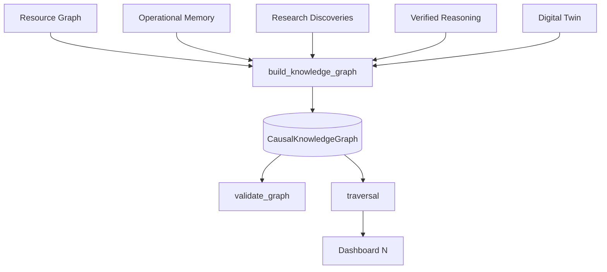
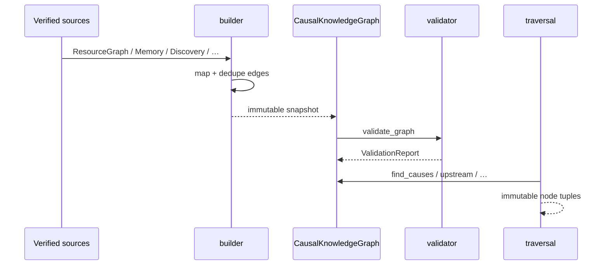

# Causal Knowledge Graph (v3.0 P3)

Deterministic **Causal Knowledge Graph** over verified relationships between
resources, workloads, intents, simulations, and operational discoveries.

**Read-only.** Built on Resource Graph + Operational Memory. Never fabricates
relationships. Does not change runtime behavior.

Dashboard shortcut: **N** ( **K** remains Cognitive Graph ).

---

## Architecture



| Module | Role |
|--------|------|
| `models.py` | Frozen `KnowledgeNode` / `KnowledgeEdge` / `CausalKnowledgeGraph` |
| `ontology.py` | Additive `KnowledgeNodeType` catalog (+ legacy `OntologyConcept`) |
| `relationships.py` | Edge type catalog + Resource Graph mapping |
| `builder.py` | Verified-only graph assembly |
| `graph.py` | Indexed read-only `KnowledgeGraphView` |
| `traversal.py` | Causes / effects / BFS / shortest path / discoveries |
| `validator.py` | Cycles, ontology, orphans, duplicates |
| `formatter.py` | Rich `CausalKnowledgePanel` |

Existing `resource_types.py` / `workload_graph.py` / concept ontology are
**unchanged**.

---

## Ontology

Supported node types:

CPU · Memory · Disk · GPU · Network · Process · Intent · Battery · Cluster ·
Simulation · Discovery · Pattern · Context · Research

Every node: `id`, `type`, `name`, `metadata`, `created_at`.

---

## Relationship model

| Relation | Meaning |
|----------|---------|
| CAUSES | Verified causal influence |
| USES | Consumer → resource |
| ALLOCATES | Allocator → allocated |
| DEPENDS_ON | Structural dependency |
| PRECEDES | Temporal / pressure ordering |
| CORRELATES | Evidence-backed co-occurrence |
| PREDICTS | Pattern / simulation prediction |
| VERIFIED_BY | Discovery → research provenance |

Every edge: `source`, `target`, `relationship`, `confidence`, `evidence_count`.
No duplicate `(source, target, relationship)` keys.

Resource Graph relations `COMMUNICATES` / `SIMULATES` are **not** mapped
(would be speculative in this layer).

---

## Knowledge lifecycle



1. Ingest only verified sources.
2. Map known relations; skip unsupported ones.
3. Drop orphan nodes (no edges).
4. Validate DAG + ontology before presentation.
5. Traverse without mutation.

---

## Causal traversal

| API | Behavior |
|-----|----------|
| `find_causes(node)` | Direct causal predecessors |
| `find_effects(node)` | Direct causal successors |
| `upstream(node)` | BFS ancestors |
| `downstream(node)` | BFS descendants |
| `shortest_causal_path(a, b)` | BFS shortest causal chain |
| `related_discoveries(node)` | Nearby Discovery nodes |

Default causal relations: `CAUSES`, `PRECEDES`, `PREDICTS`.

---

## Public API

```python
from aetheros.knowledge import (
    build_knowledge_graph,
    validate_graph,
    find_causes,
    shortest_causal_path,
)

graph = build_knowledge_graph(
    resource_graph=rg,
    memories=verified_memories,
    discoveries=discoveries,
    twin_summaries=("CPU_OVERLOAD agrees with load",),
    context_label="Coding",
)
report = validate_graph(graph)
causes = find_causes(graph, "cpu")
```

---

## Dashboard views (N, cycle with ])

| View | Content |
|------|---------|
| Causal Graph | Rich tree chain + evidence + confidence |
| Ontology | Node-type counts |
| Discoveries | Discovery nodes |
| Relationships | Edge list |
| Evidence | Evidence totals |

---

## Non-goals

- No fabricated edges
- No runtime / decision changes
- No redesign of Resource Graph or Cognitive Graph (**K**)
- No personal data
