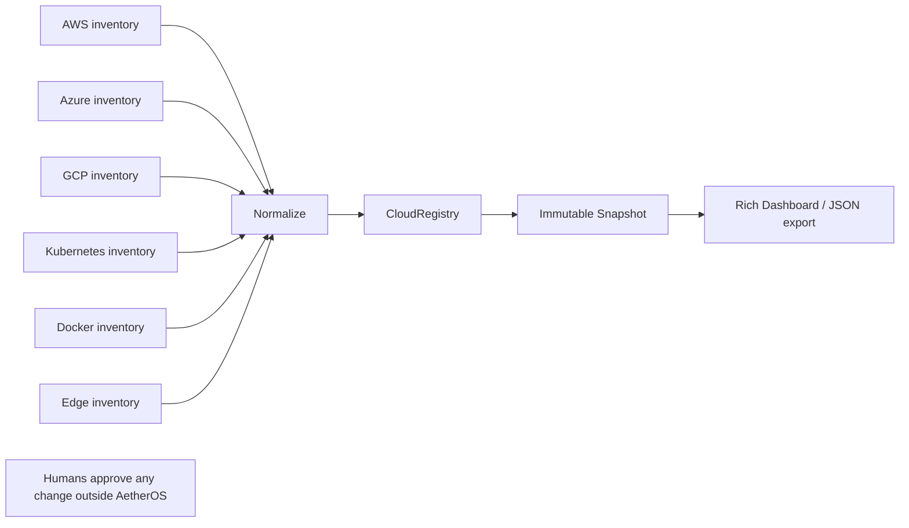
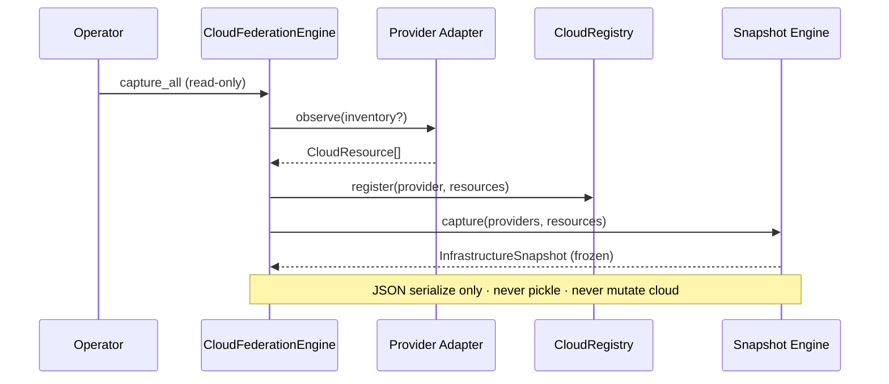

# Cloud Federation Engine — AetherOS v6.0 P1

**Package:** [`aetheros/cloud/`](../aetheros/cloud/)  
**Dashboard:** **C** → Cloud Federation (**;** remains Cluster overview)  
**Status:** Read-only infrastructure federation

---

## Philosophy

AetherOS federates **observations** of cloud and edge inventory. It never
provisions, deletes, restarts, or modifies cloud resources.

- No Terraform execution
- No kubectl execution
- No cloud SDK mutations
- No credential storage



---

## Provider architecture

Every provider is a **Federation Node** implemented as a read-only adapter:

| Adapter | Resource types |
|---------|----------------|
| `AWSProvider` | EC2 · EBS · VPC · RDS |
| `AzureProvider` | VM · Storage · Network |
| `GCPProvider` | Compute · Disk · Network |
| `KubernetesProvider` | Cluster · Node · Pod · Service |
| `DockerProvider` | Container · Image |
| `EdgeProvider` | Device · Gateway |

Adapters accept optional inventory mappings (fixtures or external exports).
When no inventory is supplied, a static **demo** inventory seeds the dashboard.



---

## Normalized resource model

All providers map into one frozen dataclass:

```text
CloudResource
  id · provider · type · name · region · metadata
```

Providers themselves are:

```text
CloudProvider
  id · name · version · region · connected
```

Snapshots:

```text
InfrastructureSnapshot
  timestamp · providers · resources · topology_hash
```

Health:

```text
FederationHealth
  online · degraded · offline · confidence
```

---

## Snapshot lifecycle

1. **capture()** — freeze providers + resources; compute `topology_hash`
2. **serialize()** — canonical or pretty JSON (no pickle)
3. **compare()** — membership + hash diff (`SnapshotDiff`)
4. **hash()** — recompute SHA-256 topology digest for verification

Registry tracks connected providers, regions, API version, snapshot age, and
health. Credentials remain external and are never stored.

---

## Dashboard

Press **C** for Cloud Federation. Views (cycle with **]**):

- Providers
- Regions
- Resources
- Health
- Snapshots

Status line always shows **Read Only**.

---

## Safety invariants

1. Observation before action (AetherOS never acts on cloud APIs).
2. Explainable census (normalized model + topology hash).
3. Simulation / comparison only — no apply path.
4. Humans remain in control of any real-world change.
