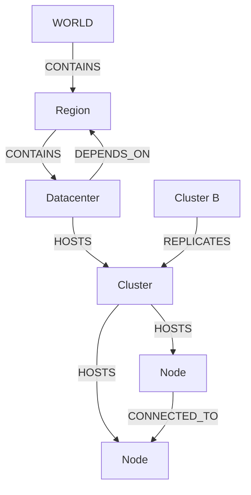
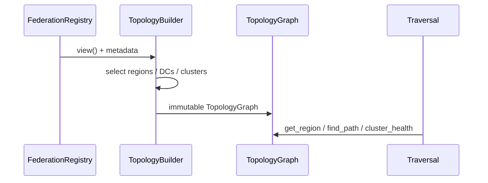

# Cluster Topology Engine — AetherOS v4.0 P2

**Package:** [`aetheros/topology/`](../aetheros/topology/)  
**Dashboard:** **Z** → Cluster Topology (**T** remains Observatory graph toggle)  
**Depends on:** [Federation Protocol](federation_protocol.md)

---

## Philosophy

Canonical distributed infrastructure model for Atlas:

```
World → Regions → Datacenters → Clusters → Nodes
```

Read-only. Built from Federation Registry evidence. Never fabricates geography that no connected node reports. Never SSH / remote execution.

---

## Hierarchy model



### Relationship types

| Relation | Meaning |
|----------|---------|
| `CONTAINS` | World→Region, Region→Datacenter |
| `HOSTS` | Datacenter→Cluster, Cluster→Node |
| `CONNECTED_TO` | Peer node links (metadata) |
| `REPLICATES` | Cluster/node replication links |
| `DEPENDS_ON` | Soft reverse dependency (DC→Region) |

---

## Builder rules

Input:

- Federation Registry / `RegistryView` (connected nodes)
- Optional `TopologyMetadata` (region/DC/cluster catalogs + placements)

Rules:

1. Regions = unique `identity.region` values observed on nodes  
2. Catalog DCs/clusters included only when their region is observed  
3. Nodes without placement → deterministic `unassigned` DC/cluster under their region  
4. Never invent unaffiliated regions (e.g. Asia catalog ignored if no Asia nodes)



---

## Traversal strategy

| API | Behavior |
|-----|----------|
| `get_region` / `get_cluster` / `get_nodes` | Point lookups / filters |
| `find_path` | BFS over directed edges (optional relation filter) |
| `cluster_health` | online/offline/unknown → healthy/degraded/critical/empty |
| `region_summary` | DC / cluster / node counts |

All return frozen objects.

---

## Dashboard views (Z, ] cycles)

Infrastructure Tree · World · Regions · Clusters · Node Health

---

## Engineering guarantees

- Frozen dataclasses  
- Immutable `TopologyGraph`  
- Evidence-backed builder  
- Type hints throughout
