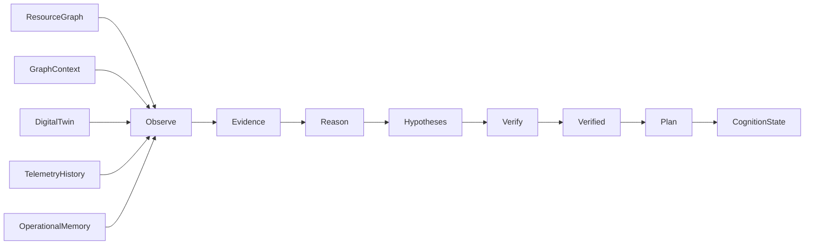
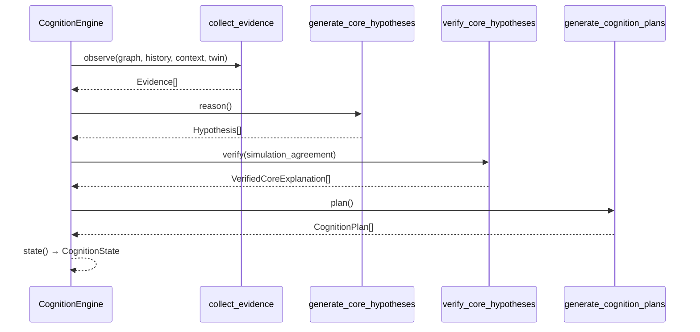

# Cognition Core (v3.0 P1)

Isolated deterministic intelligence layer that converts **graph evidence** into
structured operational understanding.

**Not an LLM.** Recommendation-only. Does not modify host OS state.

Legacy ``CognitiveRuntime`` (dashboard **K**) remains unchanged. This document
covers ``CognitionEngine`` and the v3 models in ``aetheros.cognition.models``.

---

## Architecture



| Module | Role |
|--------|------|
| `models.py` | `Evidence`, `Hypothesis` (Core), `CognitionState`, plans |
| `evidence.py` | Collect evidence from graph / context / twin / history |
| `memory.py` | `OperationalMemory` — verified system patterns only |
| `hypotheses.py` | `generate_core_hypotheses` (additive) |
| `verifier.py` | `verify_core_hypotheses` — graph + history + simulation gates |
| `planner.py` | `generate_cognition_plans` — Performance / Efficiency / Balanced |
| `engine.py` | `CognitionEngine.observe/reason/verify/plan` |
| `formatter.py` | Rich `CognitionCorePanel` |

---

## Evidence lifecycle



1. **Observe** — mint `Evidence` only from real inputs (empty ⇒ empty).
2. **Reason** — propose `Hypothesis` candidates referencing evidence ids.
3. **Verify** — accept only with graph and/or history support; optional simulation agreement floor.
4. **Plan** — emit simulation-backed Performance / Efficiency / Balanced plans; never execute.

---

## Public API

```python
from aetheros.cognition import CognitionEngine, CoreHypothesis, Evidence

engine = CognitionEngine()
state = engine.run(
    graph=resource_graph,
    history=telemetry_points,
    context="CODING",
    twin_summaries=("CPU_OVERLOAD agrees with load",),
    simulation_agreement=90.0,
)
```

| Method | Output |
|--------|--------|
| `observe(...)` | `tuple[Evidence, ...]` |
| `reason()` | `tuple[CoreHypothesis, ...]` |
| `verify(...)` | `tuple[VerifiedCoreExplanation, ...]` |
| `plan()` | `tuple[CognitionPlan, ...]` |
| `state()` / `run(...)` | `CognitionState` |

Naming note: package export ``Hypothesis`` remains the **legacy** type used by
``CognitiveRuntime``. v3 hypotheses are exported as ``CoreHypothesis``
(``aetheros.cognition.models.Hypothesis``).

---

## Memory

``OperationalMemory`` stores verified **system** patterns only, for example:

> Morning coding sessions typically increase CPU before memory pressure.

No user content. No conversations.

---

## Non-goals

- No LLM calls
- No dashboard redesign in P1
- No changes to ``CognitiveRuntime`` behavior
- No OS execution of plans
