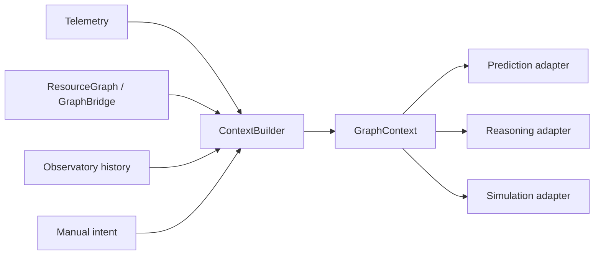
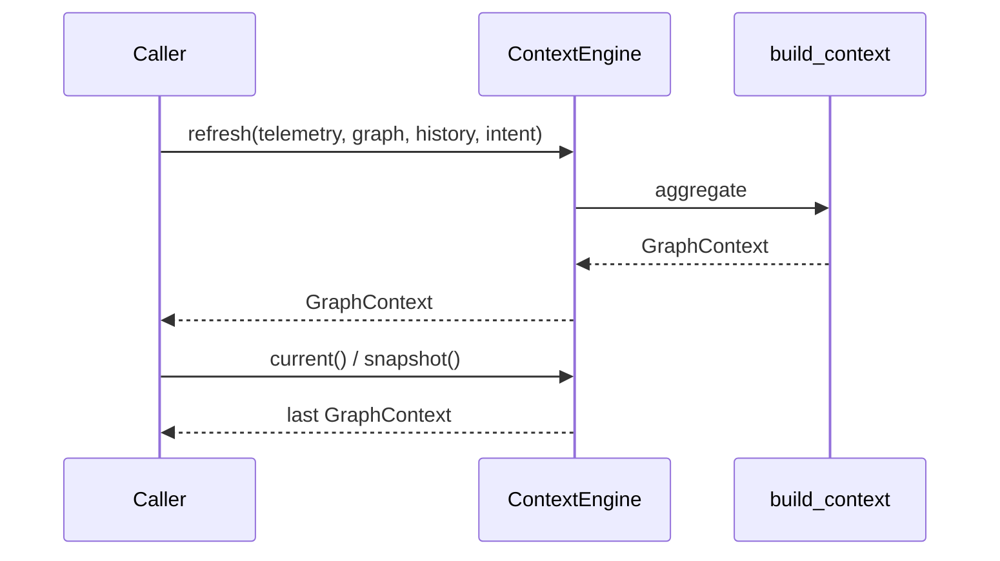

# Context Intelligence Engine (v2.0 P8)

Single **operational context** aggregate. Subsystems may optionally consume one
immutable `GraphContext` instead of juggling CPU/RAM/intent/process fields.

Does **not** rewrite telemetry, prediction, reasoning, simulation, or dashboard
runtimes. Bridge still exposes its lighter `aetheros.bridge.GraphContext`.

## Architecture



## Context lifecycle



## Data model

| Type | Role |
|------|------|
| `GraphContext` | Full operational snapshot |
| `IntentContext` | CODING / AI / GAMING / EDITING / BATTERY / BALANCED |
| `HistoricalPattern` | Best observatory similarity match |

## Integration map

| Consumer | Adapter | Notes |
|----------|---------|-------|
| Prediction | `for_prediction(ctx)` | Optional; ForecastEngine unchanged |
| Reasoning | `for_reasoning(ctx)` | Optional; graph reasoning unchanged |
| Simulation / Twin | `for_simulation(ctx)` | Optional; DigitalTwin unchanged |
| Explainability | may cite `ctx.active_intent` / pattern | No rewrite |

## Public API

```python
from aetheros.context import ContextEngine, for_prediction

engine = ContextEngine()
ctx = engine.refresh(telemetry, resource_graph=graph, history=points, manual_intent="Coding")
view = for_prediction(ctx)
```

## Constraints

- Frozen dataclasses; instance-local engine state only (no process globals)
- Read-only history matching — no SQLite schema changes
- Never guesses intent without evidence (manual-only → low confidence BALANCED)
