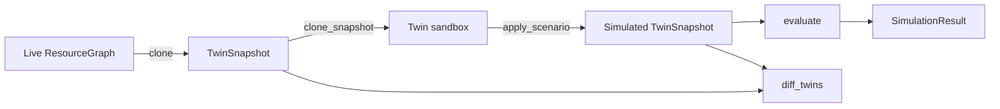
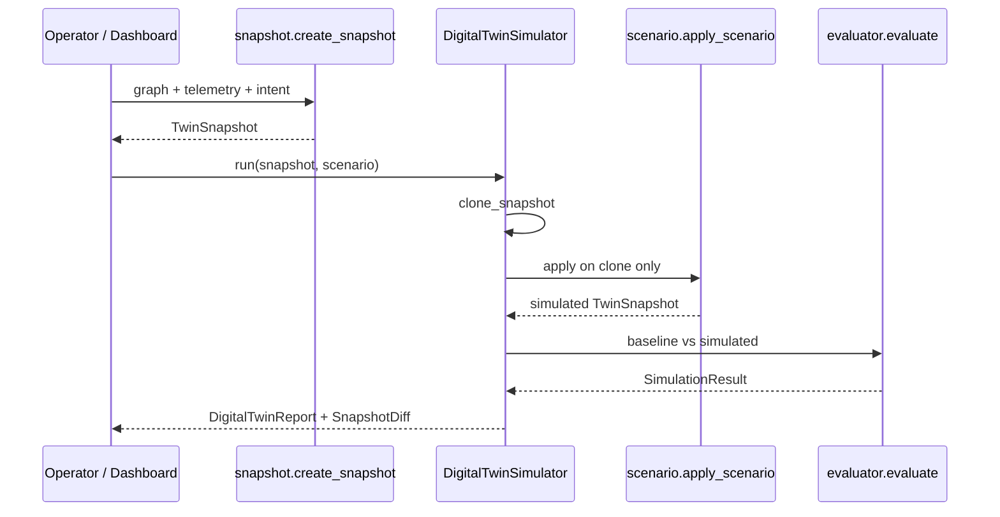

# Digital Twin 2.0 (v2.0 P7)

Immutable **host** digital twin over the Resource Graph. Answers what-if
questions with predictions only — never mutates live telemetry or the OS.

Coexists with Fabric-era **global** twin (`TwinSimulator` / `GlobalTwin`).

## Snapshot architecture



## Scenario pipeline



Built-in scenarios: `CPU_OVERLOAD`, `MEMORY_PRESSURE`, `BATTERY_LOW`,
`DISK_SATURATION`, `NODE_OFFLINE`, `CUSTOM`.

## Diff model

`SnapshotDiff` records:

- `added_nodes` / `removed_nodes`
- `changed_edges`
- `changed_metrics` (`MetricChange`: cpu/memory/disk/battery before→after)

## Dashboard

Press **V** for Digital Twin. (**D** remains Developer Console — key conflict
avoided without redesigning existing shortcuts. **T** remains Observatory metric cycle.)

## Public API

```python
from aetheros.graph import build_resource_graph
from aetheros.twin import (
    DigitalTwinSimulator,
    builtin_scenario,
    create_snapshot,
)

snap = create_snapshot(graph, telemetry, intent="Coding")
report = DigitalTwinSimulator().run(snap, builtin_scenario("CPU_OVERLOAD"))
print(report.result.predicted_cpu, report.result.stability, report.diff)
```

## Package map

| Module | Role |
|--------|------|
| `models.py` | `TwinSnapshot`, `SimulationScenario`, `SimulationResult`, `SnapshotDiff` |
| `snapshot.py` | create / clone / restore |
| `scenario.py` | Built-in scenarios + apply |
| `simulator.py` | Global `TwinSimulator` + host `DigitalTwinSimulator` |
| `evaluator.py` | Stability / risk / confidence / reasoning |
| `diff.py` | Baseline vs simulated |
| `formatter.py` | `DigitalTwinPanel` |
