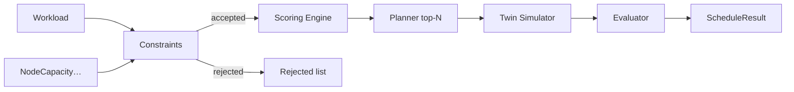
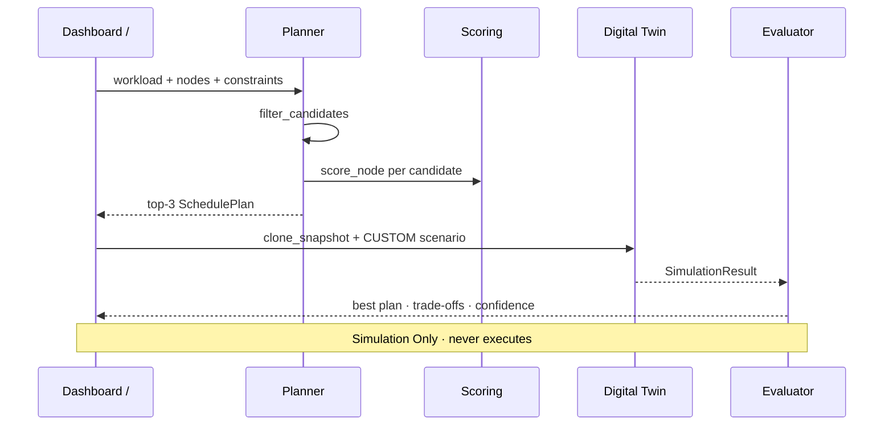

# Distributed Scheduler — AetherOS v4.0 P3

**Package:** [`aetheros/scheduler/`](../aetheros/scheduler/)  
**Dashboard:** **/** → Distributed Scheduler (**S** remains Sentinel)  
**Depends on:** [Digital Twin](digital_twin.md) · [Cluster Topology](cluster_topology.md) · [Federation Protocol](federation_protocol.md)

---

## Philosophy

The Distributed Scheduler **predicts** the best node for a workload using capacity,
latency, memory, CPU, GPU, and cluster health. It outputs **recommendations only**.

| Allowed | Forbidden |
|---------|-----------|
| Digital Twin clone + evaluate | SSH |
| Constraint filter + weighted score | Kubernetes control |
| Ranked `SchedulePlan` / `ScheduleResult` | Docker APIs |
| Dashboard overlay (simulation status) | Live topology mutation |
| | Workload execution |

---

## Scheduling architecture

---

## Scoring model

Weighted, normalized metrics → score in **[0, 100]**. No hardcoded winners.

| Metric | Default weight | Direction |
|--------|----------------|-----------|
| CPU availability | 0.25 | higher remaining after request → better |
| Memory availability | 0.20 | higher remaining → better |
| GPU availability | 0.15 | higher remaining → better |
| Latency | 0.15 | lower ms → better (`100 − 2·latency`) |
| Cluster health | 0.15 | higher → better |
| Node utilization | 0.10 | lower util (more headroom) → better |

Priority applies a gentle boost (`≤ 5%`). Weights need not sum to 1; they are
normalized by their total.

---

## Constraint system

Hard gates run **before** scoring. Failures become `(node_id, reason)` rejects.

| Kind | Meaning |
|------|---------|
| `MAX_CPU` | Projected CPU utilization must stay ≤ value |
| `MAX_MEMORY` | Projected memory utilization must stay ≤ value |
| `REQUIRE_GPU` | Node available GPU ≥ max(value, workload.gpu_request) |
| `REGION_LOCK` | Node `region_id` must match value |
| `AVOID_OVERLOAD` | Reject if utilization > threshold (default 85) |

Intrinsic capacity (request ≤ available CPU/memory/GPU) always applies.

---

## Planner · Simulator · Evaluator

1. **Planner** — `plan_placements` filters, scores, returns top N (default 3).
2. **Simulator** — `simulate_plans` clones a twin baseline per plan, applies a
   `CUSTOM` load scenario, evaluates predicted CPU / memory / latency.
   Live topology is never modified.
3. **Evaluator** — `evaluate_schedule` / `run_scheduler` pick the best plan,
   emit trade-offs vs runners-up, and blend score + twin confidence + candidate
   depth into a confidence %.

---

## Models

Frozen dataclasses: `Workload`, `NodeCapacity`, `ScheduleConstraint`,
`SchedulePlan`, `TradeOff`, `ScheduleResult`.

`ScheduleResult.status` is always `"simulation_only"`.

---

## Dashboard

- Shortcut: **/**
- Views (cycle with **]**): Summary · Workloads · Candidates · Scores · Simulation · Trade-offs
- Status line: **Simulation Only**
