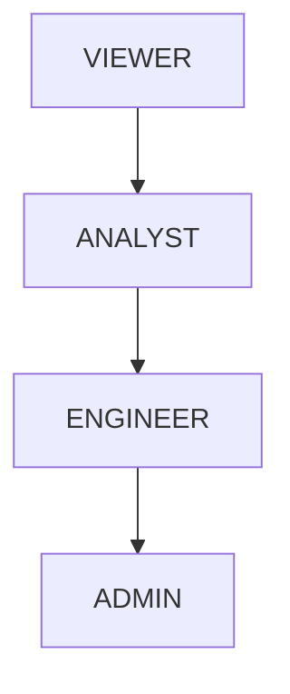
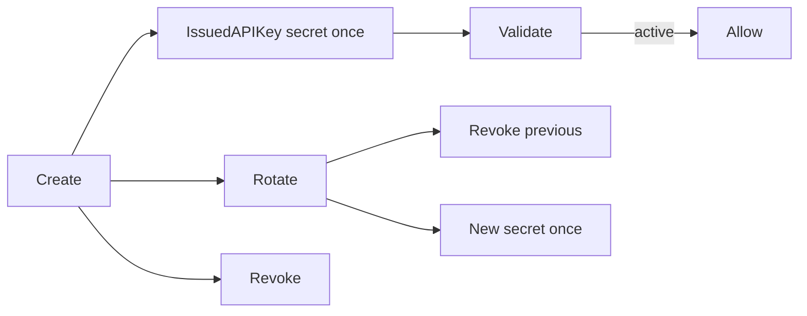
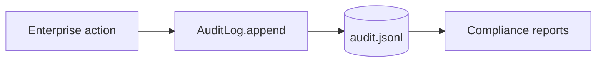

# Enterprise Edition — AetherOS v5.0 P5

**Package:** [`aetheros/enterprise/`](../aetheros/enterprise/)  
**Dashboard:** **E** → Enterprise · **@** → Extensions (marketplace)  
**Status:** Governance metadata only · core runtime unchanged

---

## Philosophy

Enterprise Edition wraps AetherOS with organization tenancy, RBAC, API keys,
append-only audit, compliance reports, and usage analytics. It does **not**
modify Resource Graph, Reasoning, Digital Twin, Scheduler, Consensus, or core
runtime behavior.

---

## RBAC model

Roles (least privilege by default — **VIEWER**):

| Role | Permissions |
|------|-------------|
| VIEWER | `READ_GRAPH`, `READ_CONTEXT` |
| ANALYST | + `READ_REASONING`, `READ_RESEARCH`, `READ_SIMULATION` |
| ENGINEER | + `MANAGE_PLUGINS` |
| ADMIN | + `MANAGE_POLICIES` (full set) |

**No wildcard permissions.** Unknown scopes are rejected.



---

## API key lifecycle



- Scopes are immutable after creation
- Raw secrets are returned only at create/rotate
- Metadata stores `key_hash` + `prefix` only

---

## Audit architecture

Append-only JSONL (`audit.jsonl`). Every org/workspace/member/key action
emits an `AuditEvent`. **Deletion is not supported.**

Examples: Policy Created · Plugin Installed · API Key Rotated · Workspace Created



---

## Compliance mapping

| Report | Formats |
|--------|---------|
| SOC2 Readiness | Markdown + JSON |
| ISO 27001 Mapping | Markdown + JSON |
| Audit Summary | Markdown + JSON |
| Access Report | Markdown + JSON |

---

## Analytics

Read-only counters:

- API usage
- Plugin usage
- Research activity
- Simulation counts
- Policy evaluations

---

## Dashboard views (E)

Organizations · Workspaces · Roles · API Keys · Audit · Compliance · Analytics

`]` cycles views.

---

## Quickstart

```python
from aetheros.enterprise import seed_demo_enterprise, has_permission, ADMIN

bundle = seed_demo_enterprise()
print(bundle.organization.name)
print(bundle.compliance_status())
assert has_permission(ADMIN, "MANAGE_POLICIES")
```
