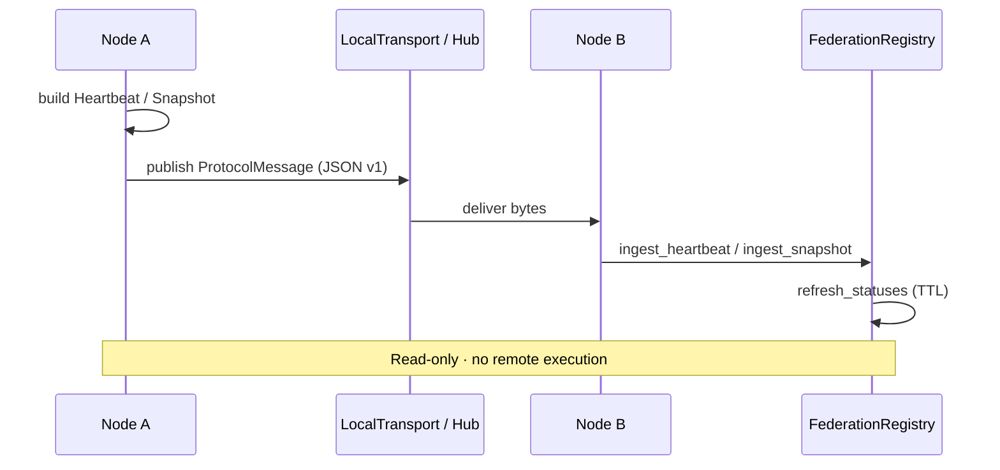
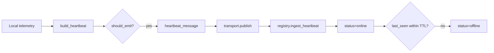

# Federation Protocol — AetherOS v4.0 P1

**Package:** [`aetheros/federation/`](../aetheros/federation/)  
**Dashboard:** **U** → Federation Protocol (**F** remains Fabric)  
**Status:** Read-only distributed infrastructure

---

## Philosophy

Multiple AetherOS nodes exchange **immutable telemetry snapshots**.  
Nodes never execute actions on each other. No SSH. No remote commands.



---

## Protocol specification

| Field | Value |
|-------|-------|
| Version | `1.0.0` (`PROTOCOL_VERSION`) |
| Encoding | UTF-8 JSON, sorted keys, compact separators |
| Compatibility | Same **major** version required |
| Forbidden | pickle, SSH, shell, mutable shared control |

### Message kinds

`heartbeat` · `snapshot` · `announce` · `goodbye`

### Envelope

```json
{
  "kind": "heartbeat",
  "protocol_version": "1.0.0",
  "source_node_id": "node-local",
  "sent_at": "2026-09-26T12:00:00.000000Z",
  "payload": {}
}
```

---

## Snapshot schema

| Field | Description |
|-------|-------------|
| `node` | `NodeIdentity` (id, hostname, version, region, created_at) |
| `telemetry` | cpu / memory / disk (+ optional network, battery) |
| `context` | Non-personal situational keys |
| `graph_hash` | Hash of publisher Resource Graph view |
| `version` | Protocol / schema version |
| `published_at` | Optional UTC timestamp |

---

## Heartbeat lifecycle



Default interval: **5s**. Default online TTL: **15s**.

---

## Registry statuses

| Status | Meaning |
|--------|---------|
| `online` | Heartbeat/snapshot within TTL |
| `offline` | TTL expired or goodbye |
| `unknown` | Announced, no pulse yet |

Never stores private user data.

---

## Dashboard views (U, ] cycles)

Connected Nodes · Registry · Heartbeats · Protocol Version

---

## Engineering guarantees

- Frozen dataclasses for wire contracts  
- Append-ingest registry (records immutable)  
- Deterministic JSON serializer  
- Local in-process transport only (demo / tests)
