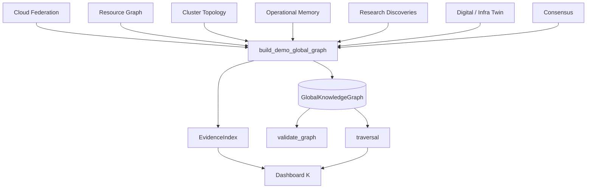
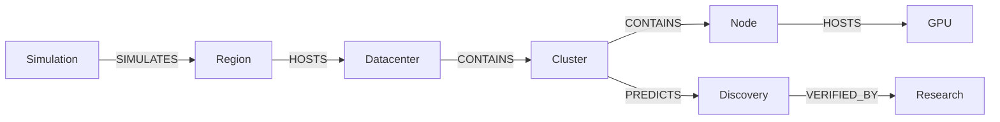

# Global Knowledge Graph — AetherOS v6.0 P3

**Package:** [`aetheros/global_graph/`](../aetheros/global_graph/)  
**Dashboard:** **K** → Global Graph (**^** remains Cognitive Graph)  
**Status:** Verified · read-only

---

## Philosophy

The Global Knowledge Graph is the **canonical Horizon intelligence model**.
It unifies Cloud Federation, Resource Graph, Cluster Topology, Operational
Memory, Research Discoveries, Digital Twin / Infra Twin, and Consensus into
one verified graph.

- Never fabricates edges
- Never modifies cloud infrastructure
- Never executes workloads
- Every relationship cites evidence



---

## Ontology

### Infrastructure

Region · Datacenter · Cluster · Node · VM · Container · Pod · Service

### Resources

CPU · Memory · GPU · Disk · Network

### Intelligence

Context · Intent · Pattern · Discovery · Simulation · Consensus · Research

Every node: `id`, `type`, `name`, `metadata`, `created_at`.

---

## Relationship model

| Relation | Meaning |
|----------|---------|
| HOSTS | Parent hosts child |
| CONTAINS | Structural containment |
| DEPENDS_ON | Hard dependency |
| COMMUNICATES | Verified communication |
| CAUSES | Causal influence |
| CORRELATES | Evidence-backed co-occurrence |
| SIMULATES | Twin / scenario linkage |
| VERIFIED_BY | Provenance |
| REPLICATES | Cross-region replication |
| PREDICTS | Discovery / forecast link |

Every edge: `source`, `target`, `relationship`, `confidence`, `evidence_count`,
`evidence_ids`.



---

## Evidence architecture

```text
EvidenceRecord
  id · kind · summary · source_ref · created_at · confidence
```

Kinds: `federation_snapshot` · `resource_graph` · `cluster_topology` ·
`operational_memory` · `research_discovery` · `digital_twin` · `infra_twin` ·
`consensus`

Validator rejects edges without evidence citations.

---

## Traversal algorithms

| API | Behavior |
|-----|----------|
| `find_region` / `find_cluster` | Lookup by id or name |
| `upstream` / `downstream` | BFS over reverse / forward edges |
| `shortest_path` | Hop-count BFS path |
| `related_discoveries` | Discovery neighbors + downstream |
| `impact_analysis` | Bounded downstream impact set |

All returns are immutable (`PathResult`, `ImpactReport`, node tuples).

---

## Validation

Rejects:

- Directed cycles
- Duplicate nodes
- Duplicate relationships
- Invalid ontology
- Orphan resource nodes
- Missing evidence

---

## Dashboard

Press **K**. Cycle with **]**:

- World Graph
- Regions
- Clusters
- Knowledge
- Discoveries
- Evidence

Status: **Verified Graph**.

---

## Safety invariants

1. Observe before linking.
2. Evidence before edges.
3. Simulation / research remain advisory.
4. Humans remain in control of cloud changes.
