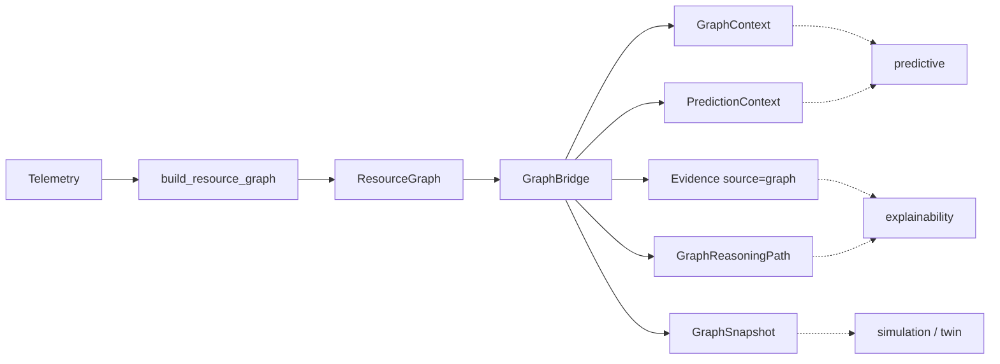

# Graph Intelligence Bridge (v2.0 P5)

Read-only integration layer. The **Resource Graph** is the canonical host
intelligence model; the bridge exposes typed, immutable views so prediction,
explainability, and simulation can consume graph queries without traversing
raw telemetry structures.

Existing engines are **not** rewritten. Runtime behaviour is unchanged until
callers opt into bridge outputs.

## Architecture



## Data flow

1. Builder (P4) materialises an immutable `ResourceGraph` from live telemetry.
2. `GraphBridge(graph)` wraps that snapshot — never mutates it.
3. Subsystems call `current_context()`, `system_evidence()`, `prediction_inputs()`,
   `reasoning_path()`, or `create_snapshot()` instead of walking CPU/memory lists.

## Sequence

```mermaid
sequenceDiagram
    participant Dash as Dashboard / API
    participant Build as graph.builder
    participant Bridge as GraphBridge
    participant Eng as Existing engines
    Dash->>Build: SystemSnapshot
    Build-->>Dash: ResourceGraph
    Dash->>Bridge: GraphBridge(graph)
    Bridge-->>Dash: GraphContext / Evidence / PredictionContext
    Note over Eng: Engines unchanged; optional consumers only
```

## Package responsibilities

| Module | Role |
|--------|------|
| `context.py` | `GraphContext`, `PredictionContext`, snapshots |
| `adapter.py` | `GraphBridge` unified facade |
| `evidence.py` | Edges → `Evidence(source="graph")` |
| `prediction.py` | Node projections for forecast adapters |
| `explainability.py` | Verified path → reasoning chain |
| `simulation.py` | Clone / snapshot / diff for twins |

## Integration map

| Consumer | Bridge entry | Notes |
|----------|--------------|-------|
| Explainability | `system_evidence()`, `reasoning_path()` | Additive `EvidenceSource="graph"` |
| Predictive | `prediction_inputs()` | ForecastEngine API unchanged |
| Simulation / Twin | `clone_graph()`, `create_snapshot()`, `diff_snapshots()` | Immutable only |
| Dashboard | optional `GraphBridge` | No UI redesign in P5 |

## Constraints

- Frozen dataclasses; no global state
- No dashboard redesign, no SQLite schema changes
- No fabricated graph links — paths require `find_path` success
- Humans remain in control; bridge is observation-only
