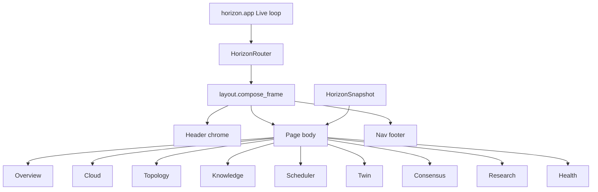
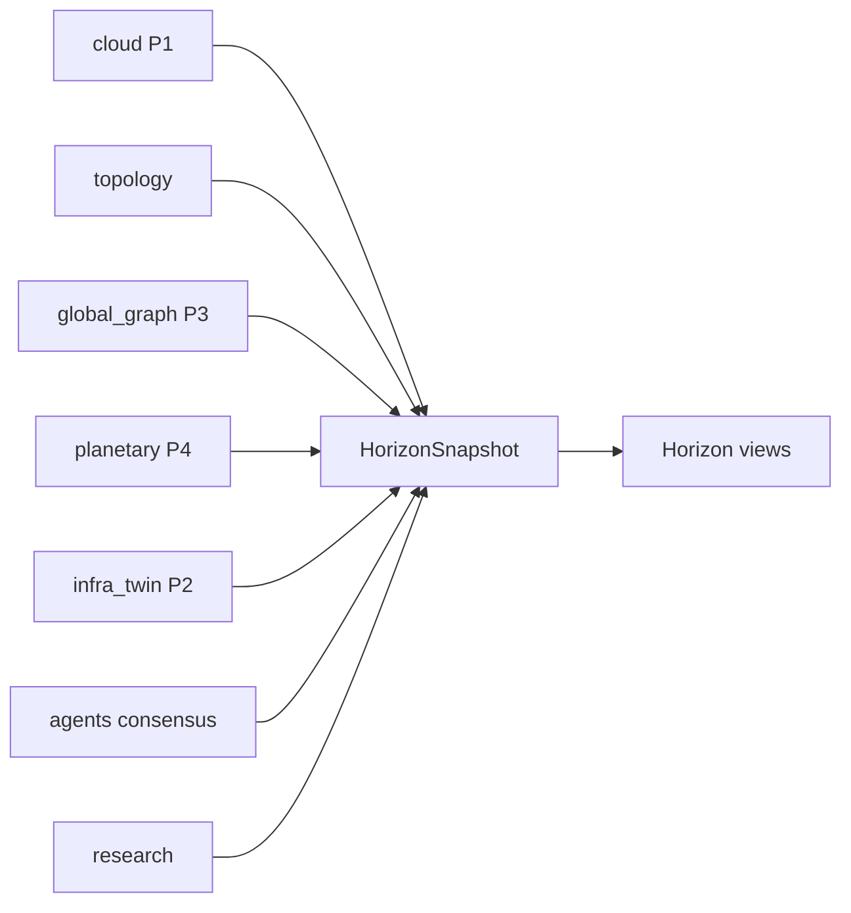

# Horizon Observatory — AetherOS v6.0 P5

**Package:** [`aetheros/horizon/`](../aetheros/horizon/) (Observatory presentation layer)  
**Entry:** `aetheros-horizon` · `python -m aetheros.horizon`  
**Status:** Presentation layer only (Rich · read-only)

Planetary intelligence modules (`runtime`, `topology`, `world_graph`, …) remain
unchanged. Observatory adds `app` · `router` · `layout` · `views/` · `widgets/`
on top of existing immutable models from Cloud Federation, Topology, Global
Graph, Planetary Scheduler, Infrastructure Twin, Consensus, and Research.

---

## Philosophy

Horizon Observatory gives operators a **single explainable view** of global
infrastructure. It answers regional health, cluster pressure, twin predictions,
consensus, discoveries, and region-failure what-ifs.

| Allowed | Forbidden |
|---------|-----------|
| Consume existing immutable models | Modify telemetry collectors |
| Rich Panels / Tables / Trees | Textual |
| Keyboard navigation (modular router) | Mutate Digital Twin / scheduler / consensus |
| Demo snapshot seeding | Change runtime behavior of P1–P4 engines |

---

## Navigation map

| Key | Page |
|-----|------|
| **O** | Overview |
| **C** | Cloud Federation |
| **T** | Topology |
| **K** | Knowledge Graph |
| **W** | Worldwide Scheduler |
| **D** | Digital Twin |
| **G** | Global Consensus |
| **R** | Research |
| **H** | Health |
| **Q** | Quit |

Router is modular (`HorizonRouter`) — page renderers are registered independently.
These hotkeys apply **inside** the Horizon Observatory process only; they do not
remap the main AetherOS dashboard.

---

## Layout architecture





---

## Widget system

| Widget | Role |
|--------|------|
| `StatCard` | Metric tile |
| `MetricGrid` | Responsive columns of StatCards |
| `HorizonTable` | Headered data grid |
| `HorizonTree` / `TreeNodeSpec` | Hierarchy rendering |
| `Timeline` | Stamp → message event list |
| `HorizonSparkline` | Compact unicode spark |

---

## Pages

### Overview
Global Health · Providers · Regions · Clusters · Nodes · Discoveries ·
Active Simulations · Consensus Confidence · recent timeline.

### Cloud
AWS · Azure · GCP · Kubernetes · Docker · Edge — provider health and snapshot age.

### Topology
Region → Datacenter → Cluster → Node as Rich Tree.

### Knowledge
Global Knowledge Graph tree · verified relationships · discoveries · evidence · confidence.

### Scheduler
Top workload · top 5 candidates · latency · availability · trade-offs · Simulation Only.

### Digital Twin
Scenario library · current / simulated infrastructure · diff · risk · stability · reasoning.

### Consensus
Node findings · votes · conflicts · quorum · final recommendation · confidence.

### Research
Daily report · weekly trends · discoveries · research journal · simulation evidence.

### Health
Federation · Graph · Scheduler · Twin · Knowledge · Research · Consensus — green / yellow / red only.

---

## Design language

* Black terminal aesthetic
* Rich Panels with minimal `grey37` borders
* Consistent typography (bold titles · dim captions)
* Responsive terminal widths via Rich Columns / expand tables
* Zero ASCII art

---

## Screenshot placeholders

> **Screenshot:** Overview — Global Health cards + recent activity timeline  
> **Screenshot:** Cloud — six-provider health table  
> **Screenshot:** Knowledge — verified graph tree  
> **Screenshot:** Scheduler — top-5 candidates with trade-offs  
> **Screenshot:** Health — green / yellow / red diagnostics

---

## Package layout

```
aetheros/horizon/
├── app.py              # Live loop entry (observatory)
├── router.py           # O/C/T/K/W/D/G/R/H dispatch
├── layout.py           # Header / footer chrome
├── snapshot.py         # HorizonSnapshot + HealthSignal
├── demo.py             # Demo seed from P1–P4 packages
├── views/              # Nine page renderers
├── widgets/            # StatCard · MetricGrid · Table · Tree · Timeline · Sparkline
├── runtime.py          # (existing) planetary intelligence
├── topology.py         # (existing)
└── …
```

Run:

```bash
aetheros-horizon
python -m aetheros.horizon --page overview
```
