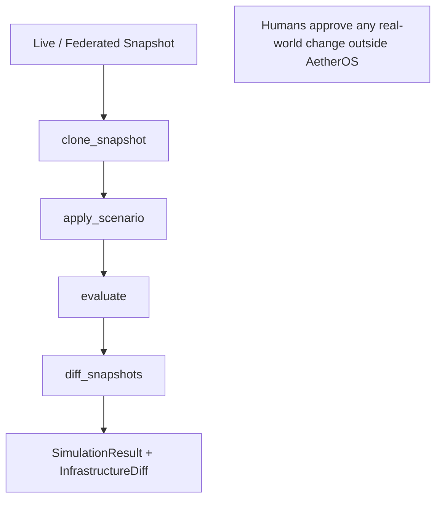
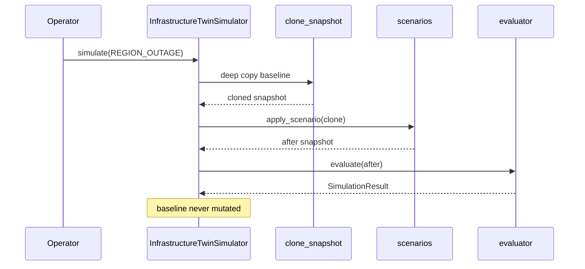

# Infrastructure Digital Twin — AetherOS v6.0 P2

**Package:** [`aetheros/infra_twin/`](../aetheros/infra_twin/)  
**Dashboard:** **I** → Infrastructure Twin (**~** remains Infinity)  
**Status:** Simulation only

---

## Philosophy

The Infrastructure Digital Twin **clones** federated infrastructure snapshots and
runs explainable what-if scenarios. It never modifies live resources.

- No AWS / Azure / GCP mutation APIs
- No Terraform / kubectl execution
- No Docker or Edge control-plane writes
- Original snapshots remain immutable

---

## Snapshot lifecycle

1. **Capture** — `demo_snapshot()` or `from_cloud_snapshot(cloud_census)`
2. **Clone** — `clone_snapshot(baseline)` → new id, deep-copied topology
3. **Scenario** — transform the clone only
4. **Evaluate** — deterministic availability / latency / risk / confidence
5. **Diff** — immutable before vs after census

---

## Scenario architecture

| Kind | Question |
|------|----------|
| `REGION_OUTAGE` | What if an AZ / region fails? |
| `NODE_FAILURE` | What if Kubernetes / compute nodes disappear? |
| `NETWORK_LATENCY` | What if latency rises? |
| `GPU_EXPANSION` | What if accelerator capacity doubles? |
| `WORKLOAD_SURGE` | What if 500 workloads arrive? |
| `DISK_FAILURE` | What if volumes fail on a fraction of nodes? |
| `CUSTOM` | Operator-defined load / latency deltas |

Every scenario returns a **new** frozen `InfrastructureSnapshot`.

---

## Evaluation pipeline

Deterministic metrics only (no ML libraries):

| Metric | Source |
|--------|--------|
| CPU / memory util | Mean load proxies on available nodes |
| Latency | Mean `latency_ms` on available nodes |
| Availability | `%` nodes still `available` |
| Stability | Weighted availability + headroom |
| Risk | Thresholds on availability / latency / load |
| Confidence | Census size + availability |

---

## Dashboard

Press **I**. Cycle views with **]**:

- Live Snapshot
- Scenario Library
- Simulation
- Diff
- Availability

Status line always shows **Simulation Only**.

---

## Safety invariants

1. Observe / clone before simulating.
2. Explain every result (`SimulationResult.explanation`).
3. Simulation before intervention — AetherOS never intervenes.
4. Humans remain in control of cloud changes.
