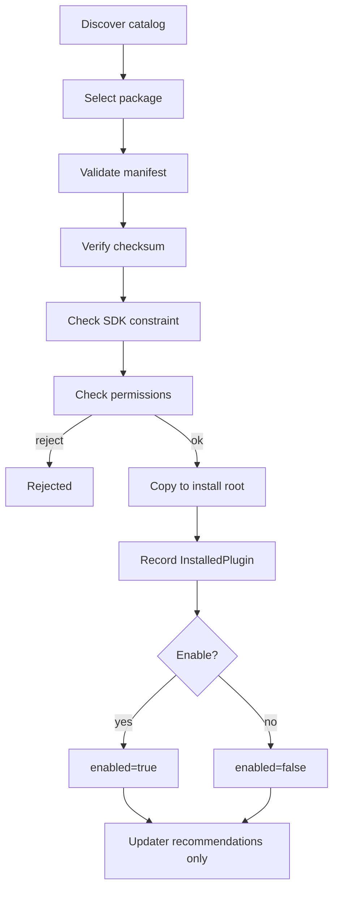
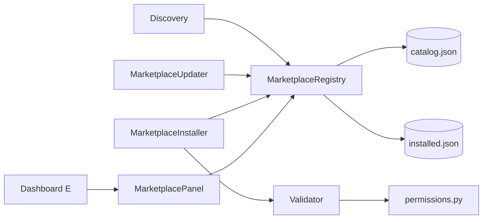

# Extension Marketplace — AetherOS v5.0 P3

**Package:** [`aetheros/marketplace/`](../aetheros/marketplace/)  
**Dashboard:** **E** → Extensions · **=** → Explainability (was E)  
**Status:** Read-only catalog · sandboxed install · no WRITE permissions

---

## Philosophy

The Extension Marketplace is a **discovery and lifecycle layer** for Plugin SDK
packages. It does **not** modify Resource Graph, Reasoning, Digital Twin,
Federation, or core runtime behavior. Plugins remain sandboxed; the marketplace
only indexes, validates, copies, and toggles enablement flags.

---

## Manifest specification

Marketplace manifests are frozen dataclasses persisted in JSON:

| Field | Type | Notes |
|-------|------|-------|
| `id` | string | Stable kebab-case id |
| `name` | string | Display name |
| `version` | string | Semver-ish |
| `author` | string | Publisher |
| `description` | string | Short summary |
| `sdk_version` | string | Constraint, e.g. `>=5.0.0,<6` |
| `category` | string | `insight`, `telemetry`, `research`, … |
| `permissions` | string[] | Read-only grants only |
| `checksum` | string | `sha256:<hex>` of package contents |

On-disk packages may ship `marketplace.json`. When absent, the validator can
bridge from Plugin SDK `plugin.yaml` metadata.

---

## Permission model

| Permission | SDK capability | Access |
|------------|----------------|--------|
| `READ_GRAPH` | `graph.read` | Read-only |
| `READ_CONTEXT` | `context.read` | Read-only |
| `READ_TELEMETRY` | `telemetry.read` | Read-only |
| `READ_RESEARCH` | `learning.analyze` | Read-only |
| `READ_SIMULATION` | `simulation.model` | Read-only |

**WRITE permissions are never allowed.** Any `WRITE_*` token fails validation.
Sandbox-by-default: install only after manifest + checksum + SDK checks.

---

## Installation lifecycle

Operations: `install` · `uninstall` · `enable` · `disable` · `verify`  
**No auto-update** — `MarketplaceUpdater` returns recommendations only.

---

## SDK compatibility

Host Plugin SDK major must satisfy `sdk_version`. Incompatible packages are
rejected at validate/install time. Deprecated catalog removals surface as
updater recommendations with `deprecated=true`.

---

## Registry & discovery

Local JSON indexes under `data/marketplace/`:

- `catalog.json` — published `MarketplaceIndex`
- `installed.json` — install-state records

Discovery filters (immutable results): category · author · SDK version ·
installed · enabled.

---

## Dashboard views (E)

| View | Contents |
|------|----------|
| Marketplace | Installed / Enabled / Updates / Top Plugin summary |
| Installed | Local packages + enable flags |
| Updates | Manual update recommendations |
| Permissions | Allowed READ_* grants |
| Plugin Details | Selected manifest fields |

`]` cycles views. ESC dismisses the overlay.

---

## Architecture

