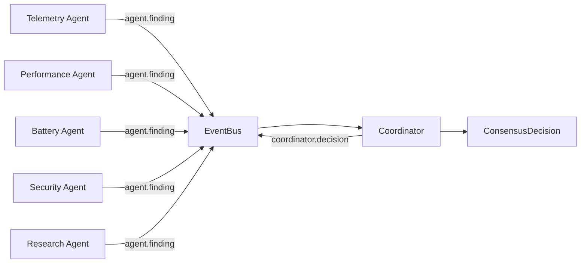
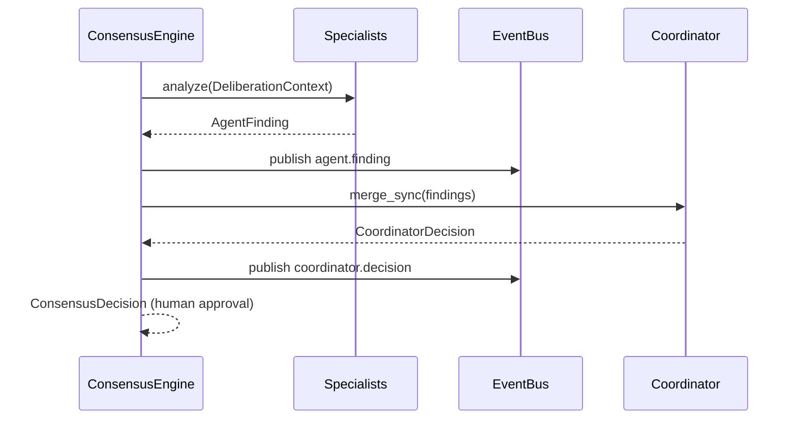

# Multi-Agent Consensus (v3.0 P4)

Deterministic multi-agent orchestration where specialists analyze evidence
independently and a Coordinator merges outputs into one explainable
recommendation.

**No LLMs. No autonomous execution.** Humans approve every recommendation.
Read-only toward telemetry / prediction / reasoning / simulation.

Dashboard shortcut: **J** ( **A** remains Research · **M** remains Multi-Agent View ).

---

## Architecture



| Module | Role |
|--------|------|
| `events.py` | Frozen `Event` + factory |
| `bus.py` | Sync publish/subscribe `EventBus` |
| `base.py` | `ConsensusFinding`, `Conflict` (+ legacy `AgentFinding`) |
| `telemetry.py` … `research.py` | P4 aliases → existing specialist agents |
| `coordinator.py` | `Coordinator` + `ConsensusEngine` + `ConsensusDecision` |
| `formatter.py` | Rich `ConsensusPanel` |

Legacy `*_agent.py`, `AsyncMessageBus`, and dashboard **M** AgenticRuntime are
**unchanged**.

---

## Event lifecycle



1. Each specialist analyzes the same read-only context independently.
2. Findings are published as immutable events (no peer calls).
3. Coordinator merges stances and records conflicts.
4. Recommendation is advice-only — never executed.

---

## Consensus algorithm

| Situation | Outcome |
|-----------|---------|
| Performance push + Battery reduce, battery weight higher | Efficiency Mode |
| Performance push dominates | Performance Mode |
| Similar weights / mixed evidence | Balanced Mode |
| Research prefers a mode (no hard conflict) | Follow research |
| Security anomaly | Annotate reasoning; slight confidence penalty |

Every `ConsensusDecision` includes:

- `recommendation`
- `supporting_agents` / `conflicting_agents`
- `confidence` (0–100)
- `reasoning` (evidence narrative)
- `conflicts` (`Conflict` records)

---

## Conflict resolution

Example:

- Performance: increase CPU allocation  
- Battery: reduce power usage  

→ **Balanced Mode** when gains are small and battery impact is significant.

`Conflict(source="performance", target="battery", disagreement=…)` is retained
for the Conflicts dashboard view.

---

## Public API

```python
from aetheros.agents import ConsensusEngine, DeliberationContext

engine = ConsensusEngine()
decision = engine.deliberate(context)
# decision.recommendation — human approval required
```

---

## Dashboard views (J, cycle with ])

| View | Content |
|------|---------|
| Consensus | Per-agent summaries + recommendation |
| Agent Status | Status lines |
| Live Findings | Evidence snippets |
| Message Bus | Recent events |
| Conflicts | Disagreement records |

---

## Non-goals

- No OS execution
- No LLM calls
- No changes to telemetry / prediction / reasoning / simulation pipelines
- No redesign of dashboard **M** Multi-Agent View
