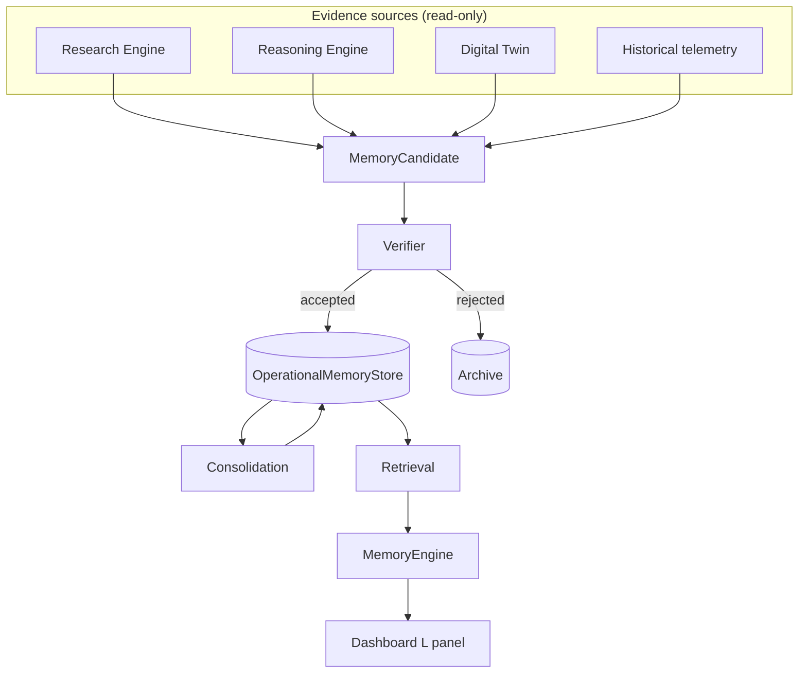
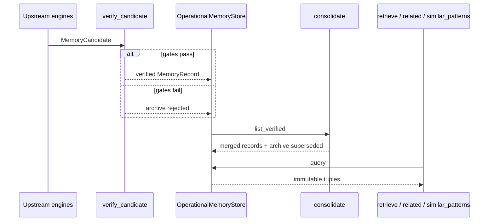

# Operational Memory (v3.0 P2)

Deterministic **long-term operational memory** for verified system knowledge.

**Not chatbot memory.** Never stores conversations, files, prompts, or personal
data. Read-only toward upstream engines. Does not change runtime behavior.

Dashboard shortcut: **L** ( **M** remains Multi-Agent ).

---

## Architecture



| Module | Role |
|--------|------|
| `models.py` | Frozen `MemoryRecord`, `Pattern`, `MemoryQuery` |
| `store.py` | Persist verified records; archive rejected / superseded |
| `verifier.py` | Promote candidates only when all gates pass |
| `consolidation.py` | Merge near-duplicate titles; retain evidence history |
| `retrieval.py` | `retrieve` / `related` / `similar_patterns` |
| `engine.py` | Public `MemoryEngine` API + curated seeds |
| `formatter.py` | Rich `OperationalMemoryPanel` |

---

## Memory lifecycle



1. **Candidate** — assembled from research / reasoning / twin / telemetry only.
2. **Verify** — evidence, reasoning, historical support, confidence, provenance.
3. **Persist** — verified records are immutable once appended.
4. **Consolidate** — near-duplicate titles merge; evidence ids are unioned.
5. **Retrieve** — public API returns frozen dataclasses only.

---

## Verification rules

A memory becomes permanent only when **all** of the following hold:

| Gate | Default |
|------|---------|
| `evidence_count >= min_evidence` | 5 |
| `reasoning_verified is True` | required |
| `historical_support is True` | required |
| `confidence >= min_confidence` | 70.0 |
| `sources` non-empty | required |

Rejected candidates are archived (never speculative writes).

---

## Consolidation strategy

Token Jaccard similarity on titles (threshold default **60%**).

Example:

- `"Compile latency"`
- `"Morning compile latency"`

→ one verified record using the longest (most specific) title, summed
`evidence_count`, union of `evidence_ids` / `sources`, refreshed
`last_verified`.

Superseded ids move to the archive with reason `consolidated`.

---

## Public API

```python
from aetheros.memory import MemoryEngine, MemoryQuery, MemoryCandidate

engine = MemoryEngine()
engine.seed_defaults()

hits = engine.retrieve(MemoryQuery(context="morning coding", metric="cpu"))
related = engine.related(hits[0].id)
patterns = engine.similar_patterns(MemoryQuery(intent="compile"))
```

| Method | Output |
|--------|--------|
| `retrieve(query)` | `tuple[MemoryRecord, ...]` |
| `related(memory_id)` | `tuple[MemoryRecord, ...]` |
| `similar_patterns(query)` | `tuple[Pattern, ...]` |
| `ingest(candidate)` | `MemoryRecord \| None` |
| `consolidate()` | `tuple[MemoryRecord, ...]` |
| `seed_defaults()` | curated verified seeds |

---

## Dashboard views (L, cycle with ])

| View | Content |
|------|---------|
| Verified Memories | Top pattern + confidence + evidence sources |
| Recent Discoveries | Newest by `last_verified` |
| Related Patterns | Similarity / occurrences / confidence |
| Evidence Timeline | Chronological evidence trail |

---

## Non-goals

- No user conversation or personal data storage
- No runtime policy / decision changes
- No LLM calls
- No dashboard redesign (additive page only)
