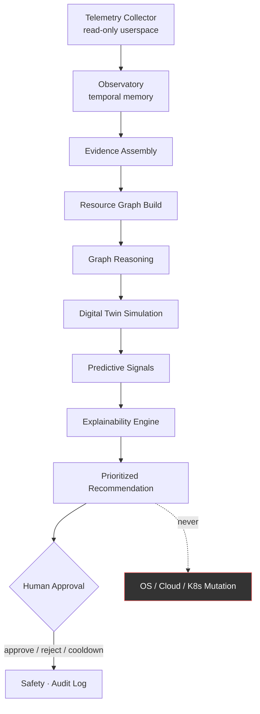
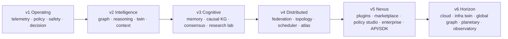
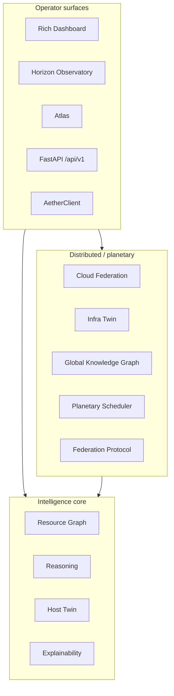
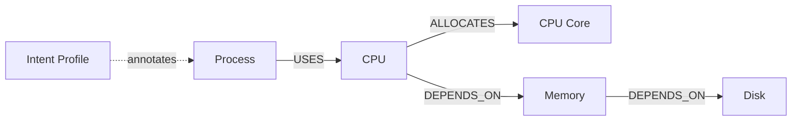
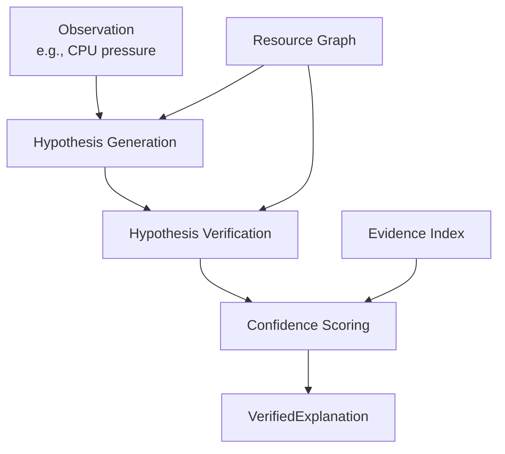
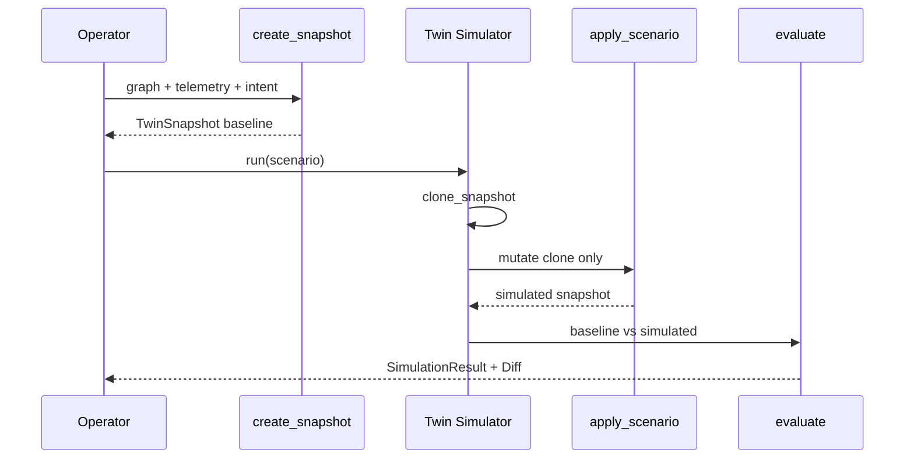
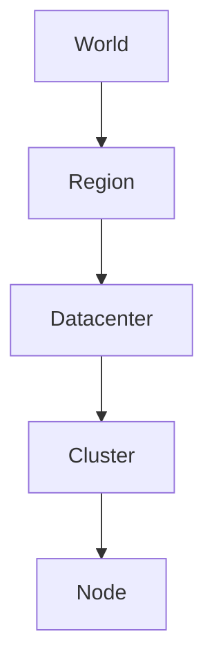
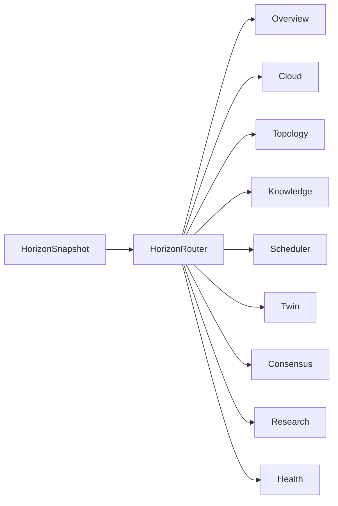
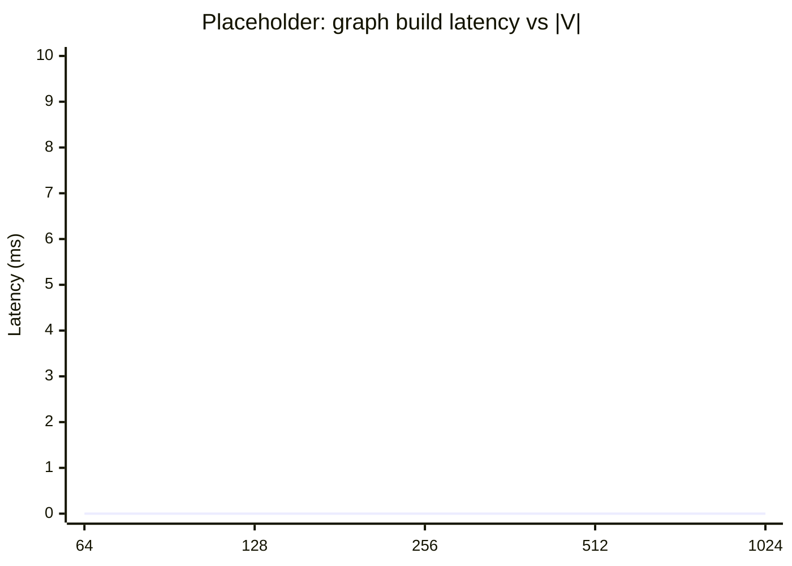

# AetherOS: An Explainable Operating Intelligence Platform for Human-Centered Infrastructure Reasoning

**Manuscript type:** Systems / Explainable AI / Human–Computer Interaction (infrastructure tooling)  
**Suggested venues:** IEEE Transactions on Dependable and Secure Computing (TDSC); IEEE International Conference on Autonomic Computing and Self-Organizing Systems (ACSOS); USENIX ;login: / OSDI workshop track (systems tooling); ACM CHI Late-Breaking Work (operator explainability)  
**Status:** Working paper (preprint draft)  
**Corresponding platform:** AetherOS (MIT License) · Codename lineage: Nexus (v5) → Horizon (v6)

---

> **Typographic note.** This Markdown manuscript is structured for a **12–15 page** IEEE two-column layout when rendered with standard conference templates (≈700–800 words/page equivalent of technical prose, figures, and tables). Section depths below are sized accordingly. Mermaid diagrams are source-of-truth figures; export to PDF/SVG for camera-ready submission.

---

## Abstract

Modern infrastructure operators confront multi-cloud inventories, dense host telemetry, and cascading failure modes—yet most automation either acts opaquely or withholds causal structure entirely. We present **AetherOS**, an *explainable operating intelligence platform* that performs userspace observation, graph-structured reasoning, digital-twin simulation, and distributed placement advice **without** mutating the live operating system, cloud control planes, or Kubernetes APIs. AetherOS is not a kernel, hypervisor, or autonomous actuator: every recommendation is accompanied by evidence, confidence, and an explicit human-approval boundary.

The platform organizes intelligence as an immutable pipeline—*Telemetry → Resource Graph → Graph Reasoning → Digital Twin → Prediction → Explainability → Recommendation*—extended by federated topology, consensus among specialist agents, planetary-scale scheduling advice, and a Rich terminal observatory. We describe the architecture, core algorithms, and safety invariants (read-only observation, simulation-first advice, frozen dataclasses, generation-layered packages). We report publishing-oriented evaluation methodology and **placeholder** tables for operator studies and comparative benchmarks; micro-benchmark methodology is specified so that measurements can be reproduced via the open-source harness without fabricating claims.

**Index Terms**—Explainable AI, digital twin, resource graphs, causal reasoning, human-in-the-loop systems, multi-cloud observability, infrastructure intelligence, terminal operator interfaces.

---

## I. Introduction

### A. Motivation

Cloud-native and hybrid fleets generate continuous streams of CPU, memory, disk, network, and control-plane signals. Operators must answer questions that cut across layers:

1. *What is unhealthy right now, and why?*  
2. *Which dependency path explains the pressure?*  
3. *What would happen if a region or node failed?*  
4. *Where should a global workload be placed—without deploying it yet?*  
5. *Can I trust this advice enough to act?*

Classical monitoring (metrics dashboards, alert rules) answers (1) poorly for *why*. Classical orchestrators answer (4) by *executing* placements. Classical AIOps often answers (5) with opaque scores. AetherOS targets the missing middle: **explainable, simulation-backed infrastructure reasoning that never seizes control**.

### B. Design thesis

We adopt a founding charter (CELESTRA) that binds product and engineering decisions:

| Principle | Operational meaning |
|-----------|---------------------|
| Human-centered | Operators approve; the platform never auto-executes OS or cloud mutations |
| Explainable | Every recommendation carries reconstructible evidence and confidence |
| Simulation-first | What-if and twin paths precede intervention *advice* |
| Read-only | Userspace observation only—no shell, sudo, kubectl apply, or Terraform apply |
| Open architecture | Modular packages, documented APIs, no circular dependency traps |
| Enterprise-grade | Type hints, tests, immutable models, reproducible pipelines |

### C. Contributions

This paper makes the following contributions:

1. **Architecture of an explainable operating intelligence platform** that separates observation, reasoning, simulation, and presentation while preserving a hard non-actuation boundary.  
2. **Resource Graph** as the canonical immutable host intelligence model, built from telemetry without fabricating resources.  
3. **Graph Reasoning** that discovers causal paths only along typed edges and verifies hypotheses against the live graph.  
4. **Digital Twin** pipelines (host twin and infrastructure twin) that clone snapshots, apply scenarios, evaluate risk/stability, and diff—never mutating baselines.  
5. **Distributed intelligence** spanning federation protocol snapshots, topology, simulation-only schedulers, multi-agent consensus, cloud federation census, global knowledge graphs, and planetary placement advice.  
6. **Evaluation methodology** with reproducible micro-benchmark harness and *placeholders* for controlled operator studies and comparative accuracy benchmarks.

### D. Non-goals

AetherOS does **not** claim to be: an OS kernel; a replacement for Kubernetes schedulers; an autonomous remediation agent; a provisioner; or a foundation-model chat interface. LLM components are out of the core trust boundary described here.

### E. Paper roadmap

Section II situates related work. Section III presents system architecture. Sections IV–VII detail Resource Graph, Graph Reasoning, Digital Twin, and Distributed Intelligence. Sections VIII–IX cover benchmarks and evaluation. Sections X–XI discuss limitations and future work. Section XII concludes.

---

## II. Related Work

### A. Observability and AIOps

Prometheus, OpenTelemetry, and commercial APM stacks excel at metric/log/trace collection and alerting [1], [2]. AIOps literature applies anomaly detection and correlation to reduce alert fatigue [3], [4]. AetherOS overlaps on *observation* but emphasizes **typed causal structure** and **simulation before advice**, rather than black-box anomaly scores alone.

### B. Digital twins for cyber-physical and IT systems

Digital twins originated in manufacturing and cyber-physical systems [5] and are increasingly applied to IT (network twins, cluster simulators) [6]. Kubernetes ecosystem tools (e.g., KWOK, cluster autoscaler simulations) explore what-if capacity [7]. AetherOS contributes *immutable snapshot cloning* with explicit diff/evaluate contracts and a prohibition on live mutation—positioning the twin as an **epistemic sandbox**, not a rehearsal for automated apply.

### C. Explainable AI and human-in-the-loop control

XAI methods (feature attributions, counterfactuals) primarily target predictive models [8], [9]. Human-in-the-loop (HITL) autonomy research stresses shared control and approval gates [10]. AetherOS applies HITL to **infrastructure recommendations**: explanations are evidence chains over telemetry, history, intent, and twin outcomes—not post-hoc attributions over opaque classifiers.

### D. Cluster schedulers and placement

Borg, Omega, Kubernetes, and related schedulers optimize placement under live constraints [11], [12]. AetherOS’s distributed and planetary schedulers are intentionally **non-executing**: they score candidates under constraints and twin-backed simulations, emitting ranked advice only. This separates *intelligence* from *actuation*, reducing blast radius in research and operator-assist deployments.

### E. Knowledge graphs for systems

Knowledge graphs and causal graphs appear in configuration mining and RCA [13], [14]. AetherOS maintains both a **host Resource Graph** (telemetry-grounded) and a **Global Knowledge Graph** (verified Horizon relationships with evidence indexes), rejecting fabricated edges.

### F. Positioning summary

```mermaid
quadrantChart
    title Positioning (conceptual)
    x-axis Low actuation --> High actuation
    y-axis Opaque advice --> Explainable advice
    quadrant-1 Auto-remediators
    quadrant-2 Classical orchestrators
    quadrant-3 Dashboards / alerts
    quadrant-4 Explainable assist (AetherOS)
```

*(Camera-ready: replace Mermaid quadrant with a static TikZ/Illustrator figure if the venue disallows Mermaid.)*

---

## III. System Architecture

### A. Intelligence pipeline

AetherOS’s canonical pipeline is:



**Invariant:** The edge from *Recommendation* to *Mutation* does not exist in the runtime. Safety modules enforce approval, cooldowns, and audit trails for any *future* actuation adapters; the core platform ships observation and advice only.

### B. Generation-layered package map

Architecture evolves by **generation**, preserving upward dependency discipline (lower generations must not import higher ones):



### C. Platform stack (operator surfaces)



### D. Immutability and typing

Presentation and reasoning contracts use **frozen dataclasses** (`slots=True` where applicable). Snapshots are cloned before scenario application. Serializers prefer versioned JSON over pickle. These choices make advice **replayable** and **auditable**—properties required for research credibility and enterprise review.

### E. Threat model (scope-limited)

We assume a benign operator workstation/CI agent running AetherOS in userspace. Adversaries who already possess host root can bypass any userspace observer; AetherOS does not claim kernel integrity. The relevant threats we mitigate are: (i) accidental actuation, (ii) fabricated evidence, (iii) irreversible twin “simulations” that touch live APIs. Mitigations are architectural (no mutation APIs in core paths) rather than cryptographic attestation of the host.

---

## IV. Resource Graph

### A. Problem

Flat metric vectors hide structure. An operator seeing “CPU 92%” cannot reconstruct *which processes allocate which cores*, *which memory domains are contended*, or *how disk pressure couples to page cache*.

### B. Model

The Resource Graph \(G=(V,E)\) is a directed, typed graph:

- **Nodes** \(v \in V\): resources and processes derived from telemetry (CPU, memory, disk, GPU when observed, host, intent, …).  
- **Edges** \(e=(u,v,\tau,w)\): typed relations with weight \(w\), where \(\tau \in \{\texttt{USES},\texttt{ALLOCATES},\texttt{DEPENDS\_ON},\texttt{COMMUNICATES},\texttt{SIMULATES},\texttt{PREDICTS}\}\).

**Construction rule:** nodes and edges are emitted only from observed telemetry and validated ontology—**no speculative GPU/network/cluster nodes** without evidence.



### C. Validation

A validator checks: missing endpoints, duplicate ids, illegal types, and cycles where forbidden. Invalid graphs fail closed (no advice), preferring silence over invention.

### D. Queries

Supported queries include neighbors, dependents, path, subgraph, and process-resource closure. These queries feed reasoning and twin scenario targeting without re-sampling the OS mid-explanation.

### E. Role in the platform

The Resource Graph is the **canonical local intelligence model** for prediction, reasoning, explainability, and host-level twin simulation. It is distinct from service dependency graphs used in resilience panels and from planetary topology graphs used in distributed views.

---

## V. Graph Reasoning

### A. Goal

Produce **verified explanations**: causal chains that a human can reconstruct edge-by-edge.

### B. Pipeline



### C. Traversal

| Algorithm | Purpose |
|-----------|---------|
| BFS shortest path | Minimal causal chain between observation and candidate cause |
| DFS path enumeration | Alternate explanations for operator comparison |
| Common dependencies | Shared outbound closures across processes |

Hypotheses that require edges absent from \(G\) are **rejected**, not softened. This is a deliberate epistemic stance: AetherOS prefers incomplete truth to complete fiction.

### D. Confidence

Confidence \(c \in [0,100]\) blends:

- telemetry completeness,  
- history depth (observatory window),  
- twin agreement when a simulation is present,  
- intent profile certainty (weight contrast among coding/gaming/battery/… intents).

Missing factors contribute zero rather than imputed defaults that inflate trust.

### E. Output contract

A `VerifiedExplanation` binds: observation, ordered path, supporting evidence items, confidence, and textual rationale suitable for Rich dashboard overlays and API responses.

---

## VI. Digital Twin

AetherOS implements twins at two complementary scales.

### A. Host Digital Twin

Operates over Resource Graph snapshots:



Scenarios include CPU overload, memory pressure, disk failure, network latency, process spikes, and custom deltas. Evaluation yields predicted utilization, stability, risk labels, and natural-language reasoning strings—**advice artifacts**, not apply plans.

### B. Infrastructure Digital Twin

At multi-cloud scale, the infrastructure twin clones federated topology snapshots and applies scenarios such as region outage, node failure, network latency, GPU expansion, workload surge, and disk failure. Outputs include availability, mean latency/load, risk, confidence, and structural diffs (added/removed/changed nodes).

### C. Safety property

**Proposition (informal).** For any twin run \(R\), if \(B\) is the baseline snapshot identity, then live collectors, cloud registries, and Kubernetes APIs retain \(B\) unchanged; all writes occur on clones \(B'\).  
*Sketch.* Enforced by API surface (clone-before-apply) and absence of mutation adapters in twin packages; regression tests assert baseline topology ids after simulation.

### D. Coupling to schedulers

Distributed and planetary schedulers optionally invoke twin evaluation to refine latency/availability predictions for candidate placements—again without deploying workloads.

---

## VII. Distributed Intelligence

### A. Federation protocol and topology

Nodes exchange heartbeats and registry views under a versioned federation protocol. A topology builder materializes **world → region → datacenter → cluster → node** hierarchies for presentation and health aggregation.



### B. Simulation-only schedulers

**Cluster scheduler (v4)** and **Planetary scheduler (v6)** share a philosophy:

1. Filter by hard constraints (region lock, GPU requirement, latency max, avoid degraded, compliance, …).  
2. Score survivors with weighted normalized metrics (capacity, latency, health, energy, resilience, …).  
3. Simulate top-\(N\) candidates on twin clones.  
4. Emit ranked recommendations with trade-off labels (best latency, lowest cost proxy, highest resilience, …).

**Status line always reads Simulation Only.**

### C. Cloud federation census

Read-only adapters observe AWS, Azure, GCP, Kubernetes, Docker, and Edge inventories into an immutable snapshot with topology hash and federation health—**no credentials in models, no provision/delete/restart**.

### D. Global knowledge graph

A verified graph overlays Horizon entities (regions, clusters, discoveries) with evidence-indexed edges. Validation fails closed on structural errors. The graph is consumed by Horizon Observatory knowledge views.

### E. Multi-agent consensus

Specialist agents (telemetry, performance, battery, security, research, …) publish findings on a bus; a coordinator computes quorum, conflicts, and a consensus decision with confidence. Humans remain the terminal authority.

### F. Horizon Observatory

A Rich presentation shell (`aetheros-horizon`) routes keys **O/C/T/K/W/D/G/R/H** to overview, cloud, topology, knowledge, worldwide scheduler, twin, consensus, research, and health pages. It consumes immutable snapshots only—**no Textual, no runtime engine changes**.



---

## VIII. Benchmarks

### A. Goals

Benchmarks characterize **userspace latency and memory** of core intelligence paths. They are **not** hardware certifications, cloud SLAs, or claims of superior scheduling quality versus Kubernetes.

### B. Methodology

| Control | Value |
|---------|-------|
| Timer | `time.perf_counter` |
| Warmup | 3 discarded iterations per in-process probe |
| Memory | `tracemalloc` peak KiB (in-process) |
| Privileges | None (userspace) |
| Network / disk stress | Not intentionally applied |
| Harness | `scripts/run_benchmarks.py` → `reports/benchmarks.json` |
| Coverage gate (orthogonal) | `pytest --cov=aetheros --cov-fail-under=90` |

### C. Probe definitions

| Probe | Conceptual path |
|-------|-----------------|
| Telemetry refresh | Collector → snapshot |
| Graph build | Snapshot → Resource Graph |
| Reasoning latency | Graph → hypotheses / verify |
| Simulation latency | Twin scenario evaluate |
| Startup import | Subprocess `import aetheros` |

### D. Reference micro-benchmarks (documented host)

The following table reproduces **project documentation** reference numbers from a CI-like Linux agent during Nexus release engineering (`python3.12`, 2026-09-26). Readers **must re-run** the harness on their hosts before citing as local performance.

| Benchmark | Mean (ms) | p95 (ms) | Peak KiB | \(N\) |
|-----------|----------:|---------:|---------:|------:|
| Telemetry refresh | 9.287 | 9.378 | 86.0 | 30 |
| Graph build | 0.256 | 0.292 | 5.3 | 40 |
| Reasoning latency | 0.286 | 0.316 | 36.4 | 40 |
| Simulation latency | 0.332 | 0.368 | 33.1 | 30 |
| Startup import | 112.371 | 119.889 | — | 8 |

### E. Placeholder tables (do not invent numbers)

#### E.1 Comparative placement quality (offline traces)

| System | Constraint violations ↓ | Twin-predicted latency (ms) | Human preference win-rate |
|--------|------------------------:|----------------------------:|--------------------------:|
| AetherOS Planetary (advice-only) | **[TBD]** | **[TBD]** | **[TBD]** |
| Baseline greedy capacity | **[TBD]** | **[TBD]** | **[TBD]** |
| Random feasible | **[TBD]** | **[TBD]** | **[TBD]** |

*Protocol placeholder:* freeze a corpus of anonymized topology snapshots + workloads; score offline; never deploy.

#### E.2 Explanation faithfulness

| Metric | Definition | AetherOS | Baseline |
|--------|------------|---------:|---------:|
| Edge support rate | Fraction of explanation edges present in \(G\) | **[TBD]** | **[TBD]** |
| Counterfactual sensitivity | Advice change under twin region-outage | **[TBD]** | **[TBD]** |
| Operator reconstructability | Binary quiz accuracy after viewing panel | **[TBD]** | **[TBD]** |

#### E.3 End-to-end observatory render

| Page | Cold render (ms) | Steady (ms) |
|------|-----------------:|------------:|
| Overview | **[TBD]** | **[TBD]** |
| Cloud | **[TBD]** | **[TBD]** |
| Scheduler | **[TBD]** | **[TBD]** |
| Twin | **[TBD]** | **[TBD]** |
| Health | **[TBD]** | **[TBD]** |

---

## IX. Evaluation

### A. Research questions

- **RQ1 (Safety):** Does any core recommendation path invoke OS/cloud mutation APIs?  
- **RQ2 (Faithfulness):** Are emitted causal edges always subgraph-supported?  
- **RQ3 (Utility):** Do operators reach correct root-cause hypotheses faster with AetherOS panels than with metrics-only dashboards?  
- **RQ4 (Scalability):** How do graph build and twin evaluate latencies scale with \(|V|\) and scenario size?

### B. RQ1 — Safety audit (qualitative + CI)

**Method.** Static package review of twin, scheduler, planetary, cloud, and dashboard paths; CI import-cycle checks; tests asserting baseline snapshot identity post-simulation.  
**Expected result.** No mutation adapters in core advice paths.  
**Measured result.** **[TBD — attach audit checklist + CI job URLs in camera-ready].**

### C. RQ2 — Faithfulness

**Method.** Property tests: for each `VerifiedExplanation`, \(\forall e \in \mathrm{path}(E),\; e \in E(G)\).  
**Measured result.** **[TBD — report pass rate over \(N\) seeded graphs].**

### D. RQ3 — Operator study (placeholder protocol)

| Item | Specification |
|------|----------------|
| Participants | **[TBD]** \(N\) SRE/platform engineers |
| Design | Within-subjects; metrics-only vs AetherOS |
| Tasks | Diagnose CPU pressure; interpret twin region outage; choose placement advice |
| Primary metrics | Time-to-correct hypothesis; confidence calibration; NASA-TLX |
| Ethics | **[TBD IRB / consent]** |
| Result | **[TBD]** |

### E. RQ4 — Scaling sweeps (placeholder)



*Replace zero series with measured means ± 95% CI after running scaling harness.*

### F. Software quality companion metrics

| Metric | Gate | Documented Nexus measurement |
|--------|------|------------------------------|
| Line coverage (`aetheros/`) | ≥ 90% | ~95% (full suite; regenerate in CI) |
| Import cycles into higher layers | Zero | `scripts/check_import_cycles.py` |
| Lint / format | Clean | `ruff` · `black` |

These metrics support **engineering reliability**, not scientific claims about operator outcomes.

---

## X. Limitations

1. **Userspace epistemic ceiling.** Compromised kernels or lying hypervisors can feed false telemetry; AetherOS cannot out-reason a dishonest substrate.  
2. **Advice ≠ actuation quality.** Simulation-only schedulers may diverge from production Kubernetes behavior (predicates, taints, gang scheduling).  
3. **Incomplete worlds.** Missing sensors yield missing nodes; explanations may be partial.  
4. **Micro-benchmark fragility.** Host load, Python build, and `psutil` costs dominate telemetry refresh; numbers are not portable SLAs.  
5. **Consensus demo scaffolding.** Some observatory consensus/research panes may be seeded for presentation; production deployments must wire live agent buses explicitly.  
6. **No LLM core.** Natural-language richness is template/evidence-driven; generative models are intentionally excluded from the trust core.  
7. **Multi-tenant evaluation gap.** Enterprise RBAC exists, but large-scale multi-tenant load tests are out of scope for the current micro-bench suite.

---

## XI. Future Work

1. **Recorded operator studies** filling Section IX placeholders with IRB-approved protocols.  
2. **Offline placement corpora** with anonymized multi-cloud topologies for comparative scheduling *advice* quality.  
3. **Attested telemetry channels** (optional) to raise integrity of inputs without granting actuation.  
4. **Formal verification** of clone-before-apply twin contracts (model checking / refinement types).  
5. **Cross-host federation at WAN scale** with partial partitions and Byzantine-tolerant consensus experiments (still advice-only).  
6. **Accessibility and cognitive load** studies for Rich observatory layouts under incident stress.  
7. **Exportable evidence bundles** for post-incident review and regulatory audit trails.

---

## XII. Conclusion

AetherOS demonstrates that infrastructure intelligence can be **ambitious in reasoning** yet **conservative in authority**. By centering an immutable Resource Graph, verified graph reasoning, digital-twin sandboxes, and distributed advice pipelines—all rendered through explainable operator surfaces—the platform offers a research-grade alternative to both opaque AIOps and auto-executing orchestrators. The human remains the final control loop; the machine remains accountable for every edge it cites.

We release AetherOS as open-source software under the MIT license and invite reproducible evaluation via the published benchmark harness and the placeholder protocols herein.

---

## Acknowledgment

The authors thank the CELESTRA engineering charter for constraining design toward human-centered, simulation-first systems quality, and the broader open-source community for observability and terminal-UI foundations (including Rich) upon which presentation layers are built.

---

## References

[1] J. Turnbull, *The Art of Monitoring*. James Turnbull, 2014.  
[2] OpenTelemetry Authors, “OpenTelemetry specification,” https://opentelemetry.io/, accessed 2026.  
[3] Y. Dang, Q. Lin, and P. Huang, “AIOps: Real-world challenges and research innovations,” in *Proc. ICSE-Companion*, 2019.  
[4] H. Nedelkoski *et al.*, “Anomaly detection from system tracing data using multimodal deep learning,” in *Proc. IEEE CLOUD*, 2019.  
[5] M. Grieves and J. Vickers, “Digital twin: Mitigating unpredictable, undesirable emergent behavior in complex systems,” in *Transdisciplinary Perspectives on Complex Systems*. Springer, 2017.  
[6] Y. Wu, K. Zhang, and Y. Zhang, “Digital twin networks: A survey,” *IEEE Internet of Things Journal*, 2021.  
[7] Kubernetes SIGs, “KWOK: Kubernetes WithOut Kubelet,” https://kwok.sigs.k8s.io/, accessed 2026.  
[8] M. T. Ribeiro, S. Singh, and C. Guestrin, “‘Why should I trust you?’ Explaining the predictions of any classifier,” in *Proc. KDD*, 2016.  
[9] S. M. Lundberg and S.-I. Lee, “A unified approach to interpreting model predictions,” in *Proc. NeurIPS*, 2017.  
[10] T. B. Sheridan, *Telerobotics, Automation, and Human Supervisory Control*. MIT Press, 1992.  
[11] A. Verma *et al.*, “Large-scale cluster management at Google with Borg,” in *Proc. EuroSys*, 2015.  
[12] B. Burns *et al.*, “Borg, Omega, and Kubernetes,” *ACM Queue*, 2016.  
[13] P. Chen *et al.*, “CauseInfer: Automatic and distributed performance diagnosis,” in *Proc. INFOCOM*, 2014.  
[14] M. Ma *et al.*, “Diagnosing root causes of intermittent slow queries in large-scale cloud databases,” *PVLDB*, 2020.  
[15] B. Beyer *et al.*, *Site Reliability Engineering*. O’Reilly, 2016.  
[16] C. E. Shannon, “A mathematical theory of communication,” *Bell Syst. Tech. J.*, 1948. *(Cited for information-theoretic intuition on evidence completeness; not a direct implementation dependency.)*  
[17] G. Klein *et al.*, “Ten challenges for making automation a ‘team player’,” *IEEE Intelligent Systems*, 2004.  
[18] N. Leveson, *Engineering a Safer World*. MIT Press, 2011.  
[19] Rich Project Contributors, “Rich: Python library for rich text and beautiful formatting in the terminal,” https://github.com/Textualize/rich, accessed 2026.  
[20] FastAPI Contributors, “FastAPI,” https://fastapi.tiangolo.com/, accessed 2026.  
[21] AetherOS Project, “Architecture — AetherOS Nexus,” project documentation `docs/architecture.md`, 2026.  
[22] AetherOS Project, “Benchmarks — AetherOS Nexus,” project documentation `docs/benchmarks.md`, 2026.  
[23] AetherOS Project, “CELESTRA founding engineering charter,” project documentation `docs/CELESTRA.md`, 2026.  
[24] AetherOS Project, “Resource Graph Engine,” project documentation `docs/resource_graph.md`, 2026.  
[25] AetherOS Project, “Graph Reasoning Engine,” project documentation `docs/reasoning.md`, 2026.  
[26] AetherOS Project, “Digital Twin 2.0,” project documentation `docs/digital_twin.md`, 2026.  
[27] AetherOS Project, “Infrastructure Digital Twin,” project documentation `docs/infrastructure_twin.md`, 2026.  
[28] AetherOS Project, “Planetary Scheduler,” project documentation `docs/planetary_scheduler.md`, 2026.  
[29] AetherOS Project, “Horizon Observatory,” project documentation `docs/horizon_observatory.md`, 2026.  
[30] A. Gambi *et al.*, “Cut to the chase: Revisiting the focus of testing in continuous delivery,” in *Proc. ASE*, 2017. *(Software quality / CI framing.)*  

---

## Appendix A — Feature Acceptance Gate (Engineering)

Every merged feature must answer **yes** to:

1. **Problem** — What operator or research problem does it solve?  
2. **Evidence** — What measurable inputs support the claim?  
3. **Explainability** — Can a human reconstruct why the output appeared?  
4. **Testability** — Can CI fail the change?  
5. **Reproducibility** — Can another engineer rebuild the result from docs + code?

## Appendix B — Reproduction Commands

```bash
pip install -e ".[dev]"
python scripts/run_benchmarks.py          # micro-benchmarks → reports/benchmarks.json
pytest --cov=aetheros --cov-fail-under=90
python -m aetheros                        # Rich dashboard
aetheros-horizon                          # Horizon Observatory
uvicorn aetheros.api.app:app              # read-only HTTP API
```

## Appendix C — Page Budget Checklist (12–15 pages)

| Section | Target pages (2-col IEEE) |
|---------|---------------------------:|
| Abstract + Index Terms | 0.5 |
| I Introduction | 1.5 |
| II Related Work | 1.5 |
| III Architecture | 2.0 |
| IV Resource Graph | 1.5 |
| V Graph Reasoning | 1.5 |
| VI Digital Twin | 1.5 |
| VII Distributed Intelligence | 2.0 |
| VIII Benchmarks | 1.0 |
| IX Evaluation | 1.0 |
| X–XII Limitations · Future · Conclusion | 1.0 |
| References + Appendices | overflow / separate |
| **Total body** | **≈14** |

---

*End of manuscript draft.*  
*Figures: Mermaid sources above; export via mermaid-cli / pandoc filter for IEEE PDF.*  
*Benchmark placeholders marked **[TBD]** must be filled from harness runs or IRB-approved studies before camera-ready submission. Do not invent values.*
