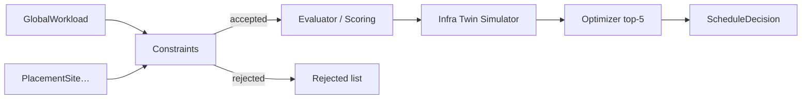
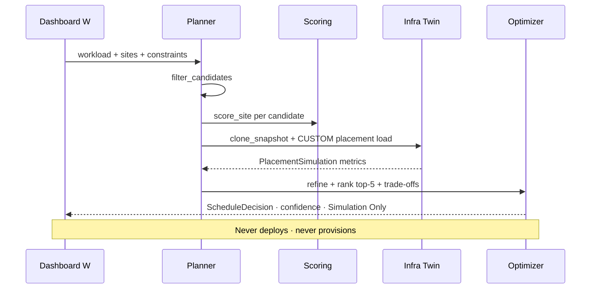

# Planetary Scheduler — AetherOS v6.0 P4

**Package:** [`aetheros/planetary/`](../aetheros/planetary/)  
**Dashboard:** **W** → Worldwide / Planetary Scheduler (**%** → Workload Planner)  
**Depends on:** [Infrastructure Twin](infrastructure_twin.md) · [Cloud Federation](cloud_federation.md) · [Global Knowledge Graph](global_knowledge_graph.md) · [Distributed Scheduler](distributed_scheduler.md)

---

## Philosophy

The Planetary Scheduler **predicts** the optimal destination for a global
workload across **region → datacenter → cluster → node**. It outputs
**recommendations only**.

| Allowed | Forbidden |
|---------|-----------|
| Infrastructure Digital Twin clone + evaluate | Kubernetes scheduling |
| Constraint filter + weighted score | Cloud provisioning |
| Top-5 `Candidate` / `ScheduleDecision` | Terraform / IaC apply |
| Dashboard overlay (Simulation Only) | Live topology mutation |
| Trade-off explanations | Workload execution / deploy |

---

## Scheduling architecture





---

## Scoring model

Weighted, normalized metrics → score in **[0, 100]**. No hardcoded winners.

| Metric | Default weight | Direction |
|--------|----------------|-----------|
| CPU capacity | 0.18 | higher remaining after request → better |
| Memory availability | 0.15 | higher remaining → better |
| GPU availability | 0.12 | higher remaining → better |
| Network latency | 0.18 | lower vs `latency_target` → better |
| Cluster health | 0.12 | higher → better |
| Energy efficiency | 0.12 | higher → better (sustainability) |
| Regional resilience | 0.13 | higher → better |

A soft `region_preference` match applies a gentle boost (≤ 4%). Weights need
not sum to 1; they are normalized by their total.

---

## Constraint system

Hard gates run **before** scoring. Failures become `(site_id, reason)` rejects.

| Kind | Meaning |
|------|---------|
| `REGION_LOCK` | Site `region` must match value |
| `LATENCY_MAX` | Site latency_ms ≤ value (default: workload target) |
| `REQUIRE_GPU` | Site GPU ≥ max(value, workload.gpu) |
| `AVOID_DEGRADED` | Reject sites flagged `degraded` |
| `ENERGY_PRIORITY` | Energy efficiency ≥ threshold (default 75) |
| `COMPLIANCE_REGION` | Require compliance tag or matching region |

Intrinsic capacity (request ≤ available CPU/memory/GPU) always applies.

---

## Optimization flow

1. **Constraints** — `filter_candidates` rejects invalid sites.
2. **Scoring / Evaluator** — `score_site` / `evaluate_sites` build candidates.
3. **Simulator** — `simulate_sites` clones an Infrastructure Digital Twin
   baseline, applies a `CUSTOM` placement load, measures latency,
   availability, CPU, memory, and failure resilience. Live infrastructure
   is never modified.
4. **Optimizer** — `optimize_placements` returns the **top 5** candidates
   (score desc, `site_id` asc — deterministic) and attaches trade-off labels:
   - Best latency
   - Lowest cost (energy-efficiency proxy)
   - Highest resilience
   - Best energy efficiency
   - Best overall / balanced alternatives
5. **Decision** — `ScheduleDecision` carries best candidate, alternatives,
   confidence, reasoning, simulations, and rejects.

---

## Core models

| Model | Role |
|-------|------|
| `GlobalWorkload` | Immutable advice input (cpu / memory / gpu / prefs) |
| `PlacementSite` | Census row: region · datacenter · cluster · node |
| `Candidate` | Scored placement with trade-off label |
| `ScheduleDecision` | Recommendation envelope (never executed) |
| `PlanetaryConstraint` | Hard gate kind + value |
| `PlacementSimulation` | Twin metrics for one site |

---

## Dashboard

- **W** — Planetary Scheduler views: Global Map · Regions · Candidates ·
  Trade-offs · Simulation Results (`]` cycles).
- **%** — Workload Planner (orchestrator), remapped from **W**.
- Status line always reads **Simulation Only**.

---

## Package layout

```
aetheros/planetary/
├── models.py        # frozen dataclasses
├── constraints.py   # hard gates
├── scoring.py       # weighted 0–100 scores
├── simulator.py     # Infra Twin clone + CUSTOM load
├── evaluator.py     # score + twin overlay
├── optimizer.py     # top-5 + trade-offs
├── planner.py       # end-to-end pipeline + demos
├── formatter.py     # Rich PlanetarySchedulerPanel
└── __init__.py
```
