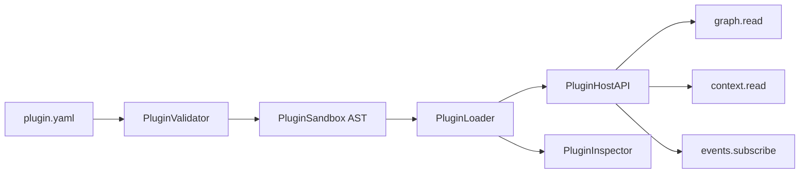

# Plugin SDK — AetherOS v5.0 P1

**Package:** [`plugins/sdk/`](../plugins/sdk/)  
**Version:** `5.0.0` (`SDK_VERSION`)  
**Status:** Sandboxed third-party intelligence plugins (does **not** modify core runtime)

---

## Philosophy

Third-party developers build sandboxed intelligence plugins **without changing
AetherOS core**. The host injects read-only Resource Graph / Context snapshots.
Plugins contribute notes, subscribe to events, and declare capabilities.

| Allowed | Forbidden |
|---------|-----------|
| YAML manifest + capability grants | Shell / sudo / subprocess |
| Read-only graph & context snapshots | Sockets / HTTP clients |
| Event subscriptions | pickle / eval / exec |
| Advisory notes & metadata | Mutating core runtime / DB schema |
| AST load-time sandbox gate | OS-level isolation claims |

> This sandbox is a **load-time gate**, not a full OS container. Prefer reviewed plugins.

---

## Architecture



---

## Manifest (YAML)

```yaml
id: hello-insight
name: Hello Insight
version: 0.1.0
author: AetherOS Examples
description: Example sandboxed insight plugin
sdk: ">=5.0.0,<6"
entry: plugin.py
enabled: true
capabilities:
  - graph.read
  - context.read
  - events.subscribe
events:
  - telemetry.tick
```

---

## Capabilities

| Capability | Meaning |
|------------|---------|
| `telemetry.read` | Read sanitized host telemetry |
| `graph.read` | Read Resource Graph snapshot |
| `context.read` | Read Context snapshot |
| `events.subscribe` | Subscribe to topics |
| `dashboard.contribute` | Contribute dashboard descriptors |
| `policy.advise` | Contribute advisory policy tips |
| `simulation.model` | Contribute simulation models |
| `learning.analyze` | Contribute learning analyzers |

---

## Quickstart

```python
from pathlib import Path
from plugins.sdk import PluginLoader, PluginHostAPI, inspect_plugins
from plugins.sdk.context import GraphSnapshot, ContextSnapshot, GraphNodeView

api = PluginHostAPI()
api.graph.set_snapshot(
    GraphSnapshot(nodes=(GraphNodeView("cpu", "CPU", "CPU"),))
)
api.context.set_snapshot(ContextSnapshot(intent="Coding"))

loader = PluginLoader()
result = loader.load_plugin(Path("plugins/examples/hello_insight"), api=api)
print(result)
```

CLI-style inspection with Rich:

```python
from rich.console import Console
from plugins.sdk import PluginLoader, inspect_plugins

loader = PluginLoader()
paths = loader.discover("plugins/examples")
results = [loader.load_plugin(p) for p in paths]
Console().print(inspect_plugins(results))
```

---

## Package map

| Module | Role |
|--------|------|
| `version.py` | SDK version + supported capabilities |
| `manifest.py` | YAML manifest parse / SDK constraint |
| `capabilities.py` | Capability registry |
| `events.py` | Event bus |
| `context.py` | Read-only graph & context |
| `plugin.py` | `IntelligencePlugin` ABC |
| `api.py` | `PluginHostAPI` |
| `sandbox.py` | AST sandbox |
| `validator.py` | Manifest validator |
| `loader.py` | Load pipeline |
| `inspector.py` | Rich inspector |

---

## Relationship to `aetheros.sdk`

`aetheros.sdk` remains the **in-tree host** plugin platform used by the
dashboard. `plugins.sdk` is the **v5 third-party SDK** surface. Core runtime
modules are not modified by this package.
