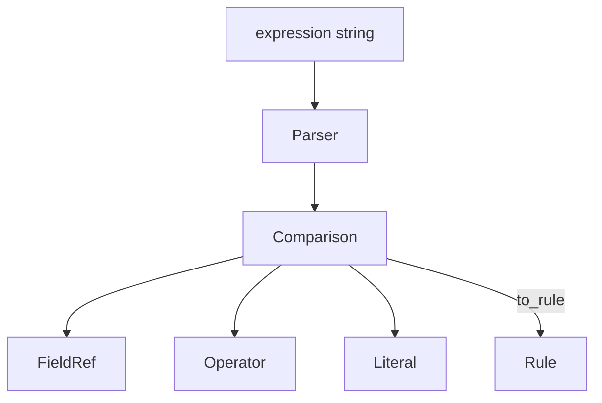
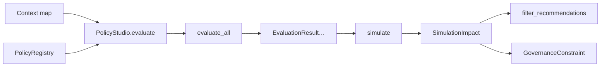

# Policy Studio — AetherOS v5.0 P4

**Package:** [`aetheros/policy/`](../aetheros/policy/)  
**Dashboard:** **P** → Policies · **#** → Predictive (was P)  
**Status:** Read-only governance · simulation / recommendation filtering only

---

## Philosophy

Policies **never** control the operating system. They only affect:

- Recommendation filtering
- Digital Twin simulation constraints
- Scheduler placement affinity (advisory)
- Research experiment annotations

No shell commands. No remote execution. No runtime rewrites of core engines.

---

## Rule language

Operators: `==` `!=` `>` `<` `>=` `<=` `IN` `NOT_IN`

```text
battery < 20
intent == CODING
region IN ["Hyderabad"]
```

Parser returns immutable AST nodes (`FieldRef`, `Literal`, `Comparison`) that
lower into frozen `Rule` objects with an advisory `action`.

---

## AST



---

## Core models

| Model | Role |
|-------|------|
| `Policy` | Versioned immutable policy (id, name, priority, rules, status) |
| `Rule` | field · operator · value · action |
| `EvaluationResult` | matched · policy · explanation · confidence |
| `SimulationImpact` | filtered recommendations + constraints |

---

## Evaluation flow



AND semantics across rules within a policy. Disabled / archived policies never
match. Results ordered by descending priority.

---

## Versioning

- `create()` → version 1
- Published policies are **immutable**
- `enable` / `disable` / edits → `new_version()`
- `archive()` appends an archived revision
- Persistence: `data/policy_studio/policies.json`

---

## Engine API

```python
from aetheros.policy import PolicyStudio, parse_rule

studio = PolicyStudio()
studio.registry.create(
    id="battery-saver",
    name="Battery Saver",
    description="Reject High Performance when battery < 20%",
    rules=(parse_rule("battery < 20", action="Reject High Performance"),),
)
studio.validate(studio.registry.get_policy("battery-saver"))
studio.list_policies()
studio.evaluate({"battery": 15})
studio.simulate({"battery": 15}, recommendations=("High Performance", "Balanced"))
```

---

## Dashboard views (P)

| View | Contents |
|------|----------|
| Active Policies | Counts + highest-priority rule/action |
| Versions | Family heads with version/status |
| Rule Builder | Operator cheat-sheet + examples |
| Evaluation | Matched policies + explanations |
| Simulation Impact | Constraints + filtered recommendations |

`]` cycles views.

---

## Legacy note

`from aetheros.policy import PolicyEngine, TelemetrySnapshot` still resolves to
`aetheros.policy_engine` for backward compatibility. Policy Studio types live
alongside those re-exports.
