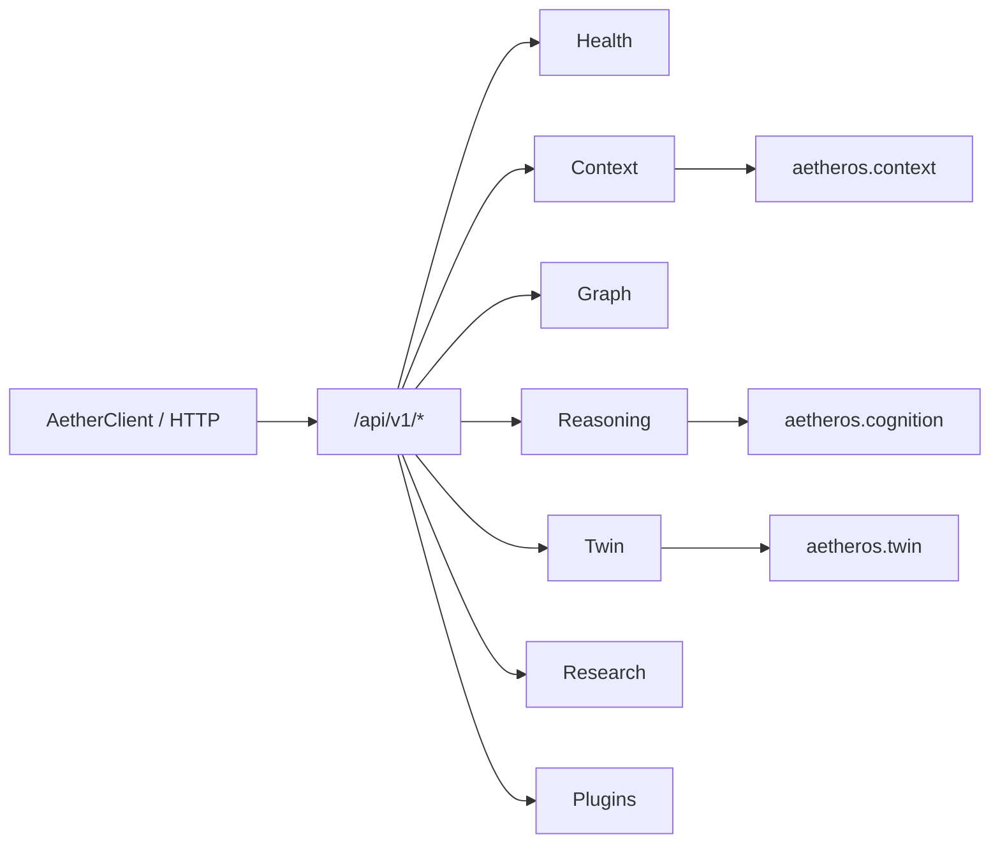

# Public API — AetherOS v5.0 P2

**Surface:** FastAPI routers under [`aetheros/api/routes/`](../aetheros/api/routes/)  
**Prefix:** `/api/v1`  
**Status:** Read-only / simulation-only

---

## Philosophy

Versioned HTTP access to existing AetherOS capabilities. Does **not** modify
core intelligence modules — routes call public engines and return Pydantic
contracts.

---

## Versioning policy

| Rule | Detail |
|------|--------|
| Prefix | `/api/v1` is the current stable public surface |
| Compatibility | Additive changes preferred within v1 |
| Breaking changes | Require `/api/v2` |
| Legacy routes | Unversioned paths (`/health`, `/graph`, …) remain for internal/demo use |

---

## Authentication placeholder

```http
Authorization: Bearer <api_key>
```

The Python SDK sends this header when `AetherClient(api_key=...)` is set.
**Server-side enforcement is not enabled in P2** — treat as a forward-compatible
placeholder. All endpoints remain publicly readable in local/dev mode.

---

## Endpoint reference

| Method | Path | Description |
|--------|------|-------------|
| `GET` | `/api/v1/health` | Liveness + API version |
| `GET` | `/api/v1/context` | Operational context projection |
| `GET` | `/api/v1/graph` | World / resource graph sample |
| `GET` | `/api/v1/reasoning` | Cognitive reasoning summary |
| `POST` | `/api/v1/twin/simulate` | Digital Twin scenario (simulation only) |
| `GET` | `/api/v1/research` | Research-grade summary |
| `GET` | `/api/v1/plugins` | Plugin SDK catalog |

### POST `/api/v1/twin/simulate`

```json
{
  "scenario": "CPU_OVERLOAD",
  "cpu_percent": 40.0,
  "memory_percent": 50.0,
  "disk_percent": 30.0
}
```

Built-in scenarios: `CPU_OVERLOAD`, `MEMORY_PRESSURE`, `BATTERY_LOW`,
`DISK_SATURATION`, `NODE_OFFLINE`.

---

## Architecture



---

## OpenAPI

Run the app and open `/docs` (Swagger UI) or `/redoc`.
