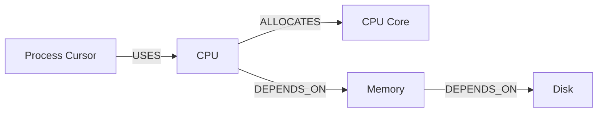
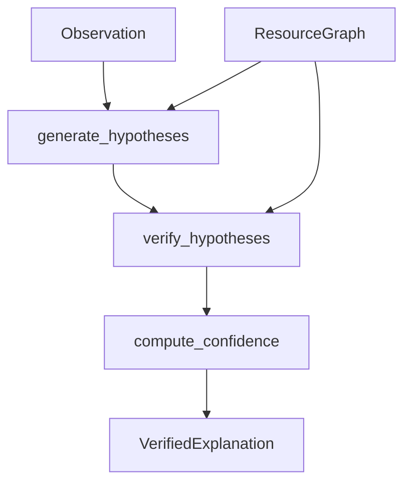

# Graph Reasoning Engine (v2.0 P6)

Discover **causal paths** inside the Resource Graph and produce verified,
explainable reasoning chains. Never fabricates relationships — every hop is a
real typed edge.

Coexists with pre-P6 cognitive helpers (`abduct`, `deduce`, `CausalGraph`
`trace_path`) in the same package.

## Causal graph



Allowed edge types: `USES`, `ALLOCATES`, `DEPENDS_ON`, `COMMUNICATES`,
`SIMULATES`, `PREDICTS`.

## Traversal strategy

| Algorithm | Function | Use |
|-----------|----------|-----|
| **BFS** | `find_shortest_path` | Minimal causal chain |
| **DFS** | `find_all_paths` | Exhaustive alternate chains |
| Neighbors | `neighbors` / `dependents` | Local topology |
| Shared | `common_dependencies` | Overlap of outbound closures |



## Confidence model

\[
confidence = 100 \times (0.35\cdot path + 0.30\cdot evidence + 0.20\cdot history + 0.15\cdot simulation)
\]

- **path** — normalised depth / coverage of supporting paths  
- **evidence** — diminishing returns on Evidence count (`min(1, n/5)`)  
- **history** — fraction of recent samples near the pressure threshold  
- **simulation** — caller-supplied agreement ratio `0–1`  

No fixed confidence constants (e.g. “always 93”).

## Dashboard

Press **R** for Graph Reasoning. (**K** remains Cognitive Graph.)

## Public API

```python
from aetheros.graph import build_resource_graph
from aetheros.reasoning import Observation, reason

graph = build_resource_graph(system_snapshot, intent_name="Coding")
explanation = reason(graph, Observation("cpu", 96.0, "CPU Overload"))
```

## Package map

| Module | Role |
|--------|------|
| `models.py` | `ReasoningPath`, `Hypothesis`, `VerifiedExplanation` |
| `traversal.py` | BFS / DFS helpers |
| `causal.py` | Cognitive helpers + ResourceGraph causal chains |
| `hypotheses.py` | Observation → graph-grounded hypotheses |
| `verifier.py` | Accept / reject + `reason()` |
| `confidence.py` | Weighted 0–100 score |
| `formatter.py` | `GraphReasoningPanel` |
