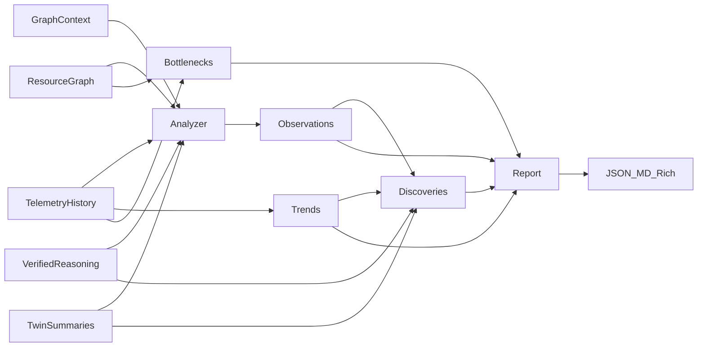
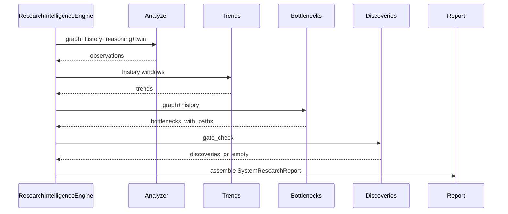

# Research Intelligence Engine (P9)

Read-only consumer of Resource Graph, GraphContext, Graph Reasoning, Digital Twin,
and observatory telemetry. Produces **evidence-backed** system research reports.

Distinct from autonomous **strategy** research (`ResearchEngine` + **A** hotkey),
which generates and ranks candidate strategies.

---

## Architecture



---

## Evidence pipeline

1. **Analyzer** — mint `ResearchObservation` only when graph paths, history deltas,
   verified reasoning, or twin summaries exist.
2. **Trends** — windows `last_hour` / `today` / `7_days` / `30_days` for
   CPU, memory, disk, battery, network, cluster health.
3. **Bottlenecks** — recurring pressure with **required** graph paths.
4. **Discoveries** — gates: min evidence · verified reasoning · optional simulation
   agreement · confidence floor. Failed gates ⇒ no discovery (never invent).
5. **Report** — daily / weekly / research_summary / simulation_summary.

---

## Discovery lifecycle



---

## Public API

| Symbol | Role |
|--------|------|
| `ResearchIntelligenceEngine` | Orchestrate evidence → `SystemResearchReport` |
| `analyze_observations` | Evidence-only observations |
| `analyze_trends` | Windowed `TrendAnalysis` |
| `detect_bottlenecks` | Path-backed bottlenecks |
| `verify_discoveries` | Gated discoveries |
| `build_report` / `export_json` / `export_markdown` | Assemble + export |
| `ResearchIntelligencePanel` | Rich terminal (dashboard **X**) |

Strategy `ResearchReport` remains unchanged for **A**.

---

## Dashboard

- **X** — Research Intelligence page (Daily / Weekly / Bottlenecks / Discoveries / Simulation)
- **]** — Cycle research intel views when X is open
- **A** — Unchanged autonomous strategy research

---

## Report example (Markdown excerpt)

```markdown
# Research Report (Research Summary)
- Context: CODING
- Observations: 2
- Verified Discoveries: 1

## Discoveries
### Observed CPU relief of 12% under verified last hour trend.
- Evidence: 22 sessions/samples
- Simulation agreement: 94%
- Confidence: 92%
```

---

## Non-goals

- No LLM-generated facts
- No PDF export
- No dashboard redesign
- No database schema mutation (append-only files optional only)
- No host OS mutation
