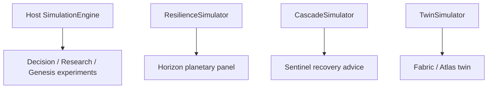

# Simulation family

AetherOS runs **simulation-first** advice. Four simulators exist on purpose —
different scopes, not accidental duplicates. They are **not** merged.

| Simulator | Package | Scope | Input | Output |
|-----------|---------|-------|-------|--------|
| **Host strategy** | `aetheros.simulation.SimulationEngine` | Local host what-if | Telemetry + strategy deltas + intent | `SimulationResult` (CPU/mem/efficiency) |
| **Planetary resilience** | `aetheros.horizon.ResilienceSimulator` | World graph failures | `WorldGraph` + `FailureScenario` | Capacity / latency / resilience scores |
| **Cascade** | `aetheros.sentinel.CascadeSimulator` | Service dependency ripple | `DependencyGraph` + anomaly | `CascadePrediction` hops |
| **Global twin** | `aetheros.twin.TwinSimulator` | Infra scenarios | `TwinScenario` | Capacity / stability / latency / risk |

## Rules

1. Every simulator is **read-only** — never mutates hosts, networks, or fleets.
2. Prefer the simulator whose **topology matches the question** (host vs world vs deps vs twin).
3. Shared scoring math may converge later; for now document boundaries instead of forcing one engine.
4. Recommendations that cite a simulation must name which family produced the evidence.

## Related

- [Architecture](architecture.md)
- [Horizon](horizon.md) · [Sentinel](sentinel.md) · [Fabric](fabric.md) · [Genesis](genesis.md)
